# 🗺️ 가상클라이언트 (임태경 - 부티크호텔 이사) 사이트맵 설계 보고서 [목적 5: 재방문/제휴 모드]

> **프로젝트명**: WICKETA x Le Serein 호텔 투숙객 리뷰 & 럭셔리 호스피탈리티 멤버십 제휴  
> **분석 대상 클라이언트**: `[가상클라이언트_08] 임태경_부티크호텔이사_인룸티타임.txt`  
> **기준 레퍼런스 분석서**: `[클라이언트05]_임태경_부티크호텔이사_인룸티타임.md`  
> **접속 목적 (Use Case 5)**: 투숙 후 인룸 웰니스 티타임 만족도 리뷰 작성 및 호텔 멤버십 포인트 적립 / 재구매 알림 신청  
> **작성일자**: 2026년 8월 14일  
> **작성자**: Antigravity UI/UX 설계팀  
> **문서 인코딩**: UTF-8  

---

## 1. 프로젝트 개요

호텔 체크아웃 후에도 객실에서의 편안했던 티타임 경험을 일상으로 이어갈 수 있도록 설계된 재방문 및 멤버십 제휴 전용 자사몰 사이트맵입니다. 45세 호텔 총괄이사 임태경의 호스피탈리티 전략을 반영하여 **호텔 인룸 티타임 포토 리뷰 갤러리**, **호텔 멤버십 마일리지 연동 적립 시스템**, **시즌별 인룸 티 신규 라인업 카카오 알림톡 신청**, **3초 패스트 Cart Drawer**를 통합 구축했습니다.

---

## 2. 계층형 사이트맵

```text
WICKETA Hospitality Guest Re-engagement & Loyalty 구축
├── [공통 영역] GNB Sticky Header / LNB B2B Switcher / Footer / Aside Cart Drawer
├── [L1-01] 1. Home (멤버십 메인 PG-01)
├── [L1-02] 2. Guest Review Showcase (투숙객 리뷰관 PG-02)
├── [L1-03] 3. Hotel Loyalty Center (멤버십 제휴 센터 PG-03)
├── [L1-04] 4. Quick Cart Drawer (3초 재주문 결제 PG-04)
├── [회원/투숙객 상태별 영역]
│   ├── [호텔 멤버십 회원] 마일리지 조회 및 전용 할인 쿠폰함 (마이페이지)
│   └── [비회원] 객실 번호 입력 1초 리뷰 작성 (가정)
├── [주요 사용자 여정]
│   └── Hero 메인 → 투숙객 포토 리뷰 감상 → 멤버십 연동 → 3초 Cart Drawer → 홈 티타임 세트 재주문
└── [예외 페이지]
    ├── [EXP-01] 404 Page Not Found (메인 안내 - 가정)
    ├── [EXP-02] 멤버십 연동 지연 안내 모달 (가정)
    └── [EXP-03] 결제 네트워크 오류 안내 (Cart Drawer 임시 저장 - 가정)
```

---

## 3. Mermaid Flowchart 사이트맵

```mermaid
flowchart TD
    classDef main fill:#2A1810,stroke:#1A0F0A,stroke-width:2px,color:#FFFFFF,font-weight:bold;
    classDef sub fill:#4A3228,stroke:#2A1810,stroke-width:2px,color:#FFFFFF,font-weight:bold;
    classDef drawer fill:#FDFBF7,stroke:#4A3228,stroke-width:2px,color:#2A1810,font-weight:bold;
    classDef common fill:#F8F9FA,stroke:#2A1810,stroke-width:1px,color:#2A1810;
    classDef member fill:#FFF3E0,stroke:#E65100,stroke-width:1.5px,color:#E65100,stroke-dasharray: 5 5;
    classDef exception fill:#FFEBEE,stroke:#C62828,stroke-width:1.5px,color:#C62828,stroke-dasharray: 3 3;

    Root["WICKETA Hospitality Loyalty (가상클라이언트05 임태경)"]
    M1["1. Home 멤버십 메인 (PG-01)"]
    M2["2. Guest Review Showcase 투숙객 리뷰 (PG-02)"]
    M3["3. Hotel Loyalty Center 멤버십 제휴 (PG-03)"]
    M4["4. Quick Cart Drawer 홈티타임 결제 (PG-04 Aside Layer)"]

    Root --> M1
    Root --> M2
    Root --> M3
    Root --> M4

    M1_1["Hero Section (호텔의 여운을 일상으로, 홈 티타임)"]
    M1_2["Guest Experience Story (투숙객 스토리)"]
    M1_3["In-Room to Home Tea Ranking (인룸 인기 랭킹)"]
    M1_4["Loyalty Partner Checklist (호텔 마일리지 연동표)"]

    M1 --> M1_1
    M1 --> M1_2
    M1 --> M1_3
    M1 --> M1_4

    M2_1["투숙객 인룸 티타임 포토 리뷰 그리드 (PG-31)"]
    M2_2["만족도 평가 & 스파 바우처 즉시 발급 폼 (PG-32)"]

    M2 --> M2_1
    M2 --> M2_2

    M2_1_1["객실 채광 & 티타임 고해상도 화보"]
    M2_1_2["실제 투숙객 음용기 & 힐링 팁"]

    M2_1 --> M2_1_1
    M2_1 --> M2_1_2

    M2_2_1["객실 번호 인증 1-Click 리뷰 작성"]
    M2_2_2["호텔 스파 15% 할인권 즉시 발급"]

    M2_2 --> M2_2_1
    M2_2 --> M2_2_2

    M3_1["호텔 멤버십 마일리지 1초 연동 (PG-33)"]
    M3_2["호텔 F&B 신규 라인업 알림톡 신청"]
    M3_3["홈 티타임 스타터 세트 1-Click 담기"]

    M3 --> M3_1
    M3 --> M3_2
    M3 --> M3_3

    M3_1_1["마일리지 100% 포인트 전환 계산기"]
    M3_2_1["차기 시즌 호텔 웰컴 티 티저 영상"]

    M3_1 --> M3_1_1
    M3_2 --> M3_2_1

    M4_1["3초 슬라이드아웃 Quick Cart Drawer (홈 세트 결제)"]
    M4_2["Virtual Scroll 위치 보존 (탐색 스크롤 100% 복원)"]

    M4 --> M4_1
    M4 --> M4_2

    MEM1["[회원 영역] 마일리지 & 쿠폰함 (PG-M01 마이페이지)"]
    GUEST1["[비회원 영역] 객실 인증 로그인 (가정)"]

    M4 -.-> MEM1
    M4 -.-> GUEST1

    EXP1["[EXP-01] 404 Page Not Found (메인 안내 - 가정)"]
    EXP2["[EXP-02] 마일리지 연동 지연 모달 (가정)"]
    EXP3["[EXP-03] 결제 오류 복원 안내 (가정)"]

    Root -.-> EXP1
    M3_1 -.-> EXP2
    M4_1 -.-> EXP3

    class Root,M1 main;
    class M2,M3 sub;
    class M4,M4_1,M4_2 drawer;
    class M1_1,M1_2,M1_3,M1_4,M2_1,M2_2,M2_1_1,M2_1_2,M2_2_1,M2_2_2,M3_1,M3_2,M3_3,M3_1_1,M3_2_1 common;
    class MEM1,GUEST1 member;
    class EXP1,EXP2,EXP3 exception;
```


