# 🗺️ 가상클라이언트 (최하은 - 공간 디자이너) 사이트맵 설계 보고서 [목적 1: 브랜딩/탐색 모드]

> **프로젝트명**: WICKETA 3D 가상 쇼룸(Virtual Tour) & 건축적 공간 미학 D2C 자사몰 구축  
> **분석 대상 클라이언트**: `[가상클라이언트_04] 최하은_공간디자이너_3D가상투어.txt`  
> **기준 레퍼런스 분석서**: `[클라이언트04]_최하은_공간디자이너_3D가상투어.md`  
> **접속 목적 (Use Case 1)**: 33세 공간 디자이너/건축가의 3D 가상 쇼룸 투어(Virtual Showroom) 탐색 및 공간과 차의 조화 감상  
> **작성일자**: 2026년 8월 14일  
> **작성자**: Antigravity UI/UX 설계팀  
> **문서 인코딩**: UTF-8  

---

## 1. 프로젝트 개요

단순한 상품 퀴즈가 아닌, 실제 인테리어 공간과 차(Tea)의 공간적 어울림을 체험할 수 있도록 설계된 '3D 가상 쇼룸(Virtual Tour)' 중심의 D2C 자사몰 사이트맵입니다. 33세 공간 디자이너 최하은의 건축적 미학을 반영하여 **웹GL 기반 3D 가상 쇼룸 투어**, **거실/서재/티룸 공간별 조화 비주얼 룩북**, **건축적 그리드 레이아웃**, **3초 슬라이드아웃 Cart Drawer**를 통합 구축했습니다.

---

## 2. 설계 근거와 핵심 사용자 목표

### 2.1 설계 근거 (Design Principles)
1. **[원칙 1 - Priority #1 Killer Feature]**: 클라이언트 고유 킬러 기능인 **`성수/도산 360도 3D 가상 공간 투어 & 1:1 시향 캘린더`**을 메인 화면(PG-01) Hero Section 최상단 및 GNB 첫 번째 메뉴로 전면 배치하여 사용자 진입 1.0초 내 시각화 및 인터랙션 실행.
1. **웹GL 3D 가상 쇼룸 투어**: 사용자가 웹상에서 직접 360도로 시점을 이동하며 미니멀 티룸 및 가구와 차의 배치를 감상
2. **공간별 티 오브제 아카이브**: 서재(집중), 거실(휴식), 침실(안식) 등 공간 테마에 최적화된 0kcal 무카페인 티 배치 가이드
3. **건축적 황금비율 그리드**: 0.5px 마이크로 라인과 여백 60% 비중의 건축 잡지 스타일 에디토리얼 레이아웃
4. **1-Click Cart Drawer & 스크롤 위치 100% 보존**: 가상 공간 투어 중 마음에 드는 공간 오브제 티 세트를 스크롤 이탈 없이 1-Click 주문

---

## 3. 계층형 사이트맵

```text
WICKETA Spatial Design & 3D Virtual Showroom 구축
├── [공통 영역] GNB Sticky Header / LNB Space Switcher / Footer / Aside Cart Drawer
├── [L1-01] 1. Home (공간 미학 메인 PG-01)
├── [L1-02] 2. 3D Virtual Showroom (가상 쇼룸 투어 PG-02)
├── [L1-03] 3. Spatial Archive (공간별 티 아카이브 PG-03)
├── [L1-04] 4. Cart Drawer (3초 패스트 결제 PG-04)
├── [회원 상태별 영역]
│   ├── [회원] 저장된 공간 3D 투어 뷰포트 및 오브제 장바구니 (마이페이지)
│   └── [비회원] 공간 인테리어 3D 룩북 PDF 다운로드 (가정)
├── [주요 사용자 여정]
│   └── Hero 메인 → 3D 가상 쇼룸 투어 → 공간별 오브제 티 확인 → 3초 Cart Drawer → 주문 완료
└── [예외 페이지]
    ├── [EXP-01] 404 Page Not Found (메인 안내 - 가정)
    ├── [EXP-02] 웹GL 렌더링 저사양 모드 전환 모달 (2D 룩북 전환 - 가정)
    └── [EXP-03] 결제 네트워크 오류 안내 (Cart Drawer 임시 저장 - 가정)
```

---

## 4. Mermaid Flowchart 사이트맵

```mermaid
flowchart TD
    classDef main fill:#1E2621,stroke:#0D120F,stroke-width:2px,color:#FFFFFF,font-weight:bold;
    classDef sub fill:#3E4E44,stroke:#1E2621,stroke-width:2px,color:#FFFFFF,font-weight:bold;
    classDef drawer fill:#E8EBE9,stroke:#3E4E44,stroke-width:2px,color:#1E2621,font-weight:bold;
    classDef common fill:#F5F7F6,stroke:#1E2621,stroke-width:1px,color:#1E2621;
    classDef member fill:#FFF3E0,stroke:#E65100,stroke-width:1.5px,color:#E65100,stroke-dasharray: 5 5;
    classDef exception fill:#FFEBEE,stroke:#C62828,stroke-width:1.5px,color:#C62828,stroke-dasharray: 3 3;

    Root["WICKETA Spatial Sanctuary (가상클라이언트04 최하은)"]
    M1["1. Home 공간 미학 메인 (PG-01)"]
    M2["2. 3D Virtual Showroom 가상투어 (PG-02)"]
    M3["3. Spatial Archive 공간별 티 (PG-03)"]
    M4["4. Cart Drawer 결제 (PG-04 Aside Layer)"]

    Root --> M1
    Root --> M2
    Root --> M3
    Root --> M4

    M1_1["Hero Section (공간과 차의 건축적 조화)"]
    M1_2["Spatial Aesthetic Story (건축적 미학 에세이)"]
    M1_3["Minimalist Tea Room Lookbook (미니멀 화보)"]
    M1_4["Zero Sugar Clean Verification (원료 검증표)"]

    M1 --> M1_1
    M1 --> M1_2
    M1 --> M1_3
    M1 --> M1_4

    M2_1["360도 웹GL 가상 쇼룸 투어 뷰어 (PG-31)"]
    M2_2["공간 핫스팟 인터랙션 (서재/거실/티룸)"]

    M2 --> M2_1
    M2 --> M2_2

    M2_1_1["빛과 그림자 시뮬레이션 (Day & Night)"]
    M2_1_2["가구 및 세라믹 다기 3D 회전 모델"]

    M2_1 --> M2_1_1
    M2_1 --> M2_1_2

    M2_2_1["공간별 맞춤 티 팩 1-Click 팝업"]
    M2_2_2["공간 오브제 번들 담기"]

    M2_2 --> M2_2_1
    M2_2 --> M2_2_2

    M3_1["공간 테마별 아카이브 (PG-32)"]
    M3_2["건축가 세라믹 다기 세트 쇼케이스"]
    M3_3["오프라인 팝업 공간 예약 (PG-33)"]

    M3 --> M3_1
    M3 --> M3_2
    M3 --> M3_3

    M3_1_1["차음/집중/휴식 공간별 테이스팅 가이드"]
    M3_2_1["핸드메이드 세라믹 코스터 스펙"]

    M3_1 --> M3_1_1
    M3_2 --> M3_2_1

    M4_1["슬라이드아웃 Cart Drawer (공간 오브제 주문서)"]
    M4_2["Virtual Scroll 위치 보존 (탐색 스크롤 100% 복원)"]

    M4 --> M4_1
    M4 --> M4_2

    MEM1["[회원 영역] 저장된 쇼룸 뷰포트 (PG-M01 마이페이지)"]
    GUEST1["[비회원 영역] 3D 쇼룸 룩북 PDF 다운로드 (가정)"]

    M4 -.-> MEM1
    M4 -.-> GUEST1

    EXP1["[EXP-01] 404 Page Not Found (메인 공간 안내 - 가정)"]
    EXP2["[EXP-02] 웹GL 저사양 2D 모드 전환 안내 (가정)"]
    EXP3["[EXP-03] 결제 오류 쇼룸 뷰포트 복원 안내 (가정)"]

    Root -.-> EXP1
    M2_1 -.-> EXP2
    M4_1 -.-> EXP3

    class Root,M1 main;
    class M2,M3 sub;
    class M4,M4_1,M4_2 drawer;
    class M1_1,M1_2,M1_3,M1_4,M2_1,M2_2,M2_1_1,M2_1_2,M2_2_1,M2_2_2,M3_1,M3_2,M3_3,M3_1_1,M3_2_1 common;
    class MEM1,GUEST1 member;
    class EXP1,EXP2,EXP3 exception;
```


