# 🗺️ 가상클라이언트 (최하은 - 공간 디자이너) 사이트맵 설계 보고서 [목적 3: 커스텀/선물 모드]

> **프로젝트명**: WICKETA 건축가 세라믹 다기 & 공간 오브제 티 선물 세트 자사몰 구축  
> **분석 대상 클라이언트**: `[가상클라이언트_04] 최하은_공간디자이너_3D가상투어.txt`  
> **기준 레퍼런스 분석서**: `[클라이언트04]_최하은_공간디자이너_3D가상투어.md`  
> **접속 목적 (Use Case 3)**: 공간의 무드를 완성하는 건축가 세라믹 다기 세트 3D 라이브 각인 및 공간 오브제 티 선물 세트 신청  
> **작성일자**: 2026년 8월 14일  
> **작성자**: Antigravity UI/UX 설계팀  
> **문서 인코딩**: UTF-8  

---

## 1. 프로젝트 개요

새로운 공간으로 이사하거나 나만의 티룸을 꾸미는 건축/인테리어 애호가에게 공간의 품격을 더해주는 세라믹 다기와 차를 선물할 수 있도록 설계된 공간 기프팅 전용 사이트맵입니다. 공간 디자이너 최하은의 조형미를 담아 **3D 세라믹 컵/플레이트 바닥면 시그니처 각인 시뮬레이터**, **공간 테마별(Living/Study/Tea Room) 오브제 티 번들 빌더**, **건축적 도면 스타일 메시지 카드 및 Gift Drawer 결제**를 통합 구축했습니다.

---

## 2. 계층형 사이트맵

```text
WICKETA Spatial Object & Bespoke Gift Studio 구축
├── [공통 영역] GNB Sticky Header / LNB Space Switcher / Footer / Aside Cart Drawer
├── [L1-01] 1. Home (선물 메인 PG-01)
├── [L1-02] 2. Custom Studio (3D 세라믹 각인 스튜디오 PG-02)
├── [L1-03] 3. Spatial Gift Showcase (공간 선물관 PG-03)
├── [L1-04] 4. Gift Drawer (3초 선물 결제 PG-04)
├── [회원 상태별 영역]
│   ├── [회원] 저장된 3D 다기 각인 템플릿 관리 (마이페이지)
│   └── [비회원] 감성 건축 도면 스타일 모바일 카드 무료 발급 (가정)
├── [주요 사용자 여정]
│   └── Hero 메인 → 3D 세라믹 다기 각인 → 공간 번들 구성 → 3초 Gift Drawer → 선물 결제 완료
└── [예외 페이지]
    ├── [EXP-01] 404 Page Not Found (메인 안내 - 가정)
    ├── [EXP-02] 세라믹 다기 한정 수량 품절 모달 (재입고 알림 - 가정)
    └── [EXP-03] 각인 글자수 초과 에러 모달 (가정)
```

---

## 3. Mermaid Flowchart 사이트맵

```mermaid
flowchart TD
    classDef main fill:#1E2621,stroke:#0D120F,stroke-width:2px,color:#FFFFFF,font-weight:bold;
    classDef sub fill:#3E4E44,stroke:#1E2621,stroke-width:2px,color:#FFFFFF,font-weight:bold;
    classDef drawer fill:#E8EBE9,stroke:#3E4E44,stroke-width:2px,color:#1E2621,font-weight:bold;
    classDef common fill:#F5F7F6,stroke:#1E2621,stroke-width:1px,color:#1E2621;
    classDef member fill:#FFF3E0,stroke:#E65100,stroke-width:1.5px,color:#E65100,stroke-dasharray: 5 5;
    classDef exception fill:#FFEBEE,stroke:#C62828,stroke-width:1.5px,color:#C62828,stroke-dasharray: 3 3;

    Root["WICKETA Spatial Gift Studio (가상클라이언트04 최하은)"]
    M1["1. Home 공간 선물 메인 (PG-01)"]
    M2["2. Custom Studio 3D 세라믹 각인 (PG-02)"]
    M3["3. Spatial Gift Showcase 공간 선물관 (PG-03)"]
    M4["4. Gift Drawer 공간 결제 (PG-04 Aside Layer)"]

    Root --> M1
    Root --> M2
    Root --> M3
    Root --> M4

    M1_1["Hero Section (공간을 완성하는 세라믹과 차 선물)"]
    M1_2["3D Ceramic Tableware Preview (3D 다기 렌더러)"]
    M1_3["Tea Room Object Bundle (공간 티 4종 세트)"]
    M1_4["Architect Certification Checklist (핸드메이드 품질 보증서)"]

    M1 --> M1_1
    M1 --> M1_2
    M1 --> M1_3
    M1 --> M1_4

    M2_1["실시간 3D 세라믹 바닥 각인 시뮬레이터 (PG-31)"]
    M2_2["무광 샌드 / 테라코타 세라믹 재질 스위처"]

    M2 --> M2_1
    M2 --> M2_2

    M2_1_1["건축적 미니멀 폰트 3종 시뮬레이션"]
    M2_1_2["내열 세라믹 음각 인쇄 내구성 안내"]

    M2_1 --> M2_1_1
    M2_1 --> M2_1_2

    M2_2_1["세라믹 다기 360도 3D 회전 뷰어"]
    M2_2_2["천연 코스터 패키지 뷰어"]

    M2_2 --> M2_2_1
    M2_2 --> M2_2_2

    M3_1["공간 테마별(서재/거실/침실) 티 번들 빌더 (PG-32)"]
    M3_2["건축 청사진 스타일 감성 모바일 카드 폼 (PG-33)"]
    M3_3["1-Click 카카오 선물하기 연동"]

    M3 --> M3_1
    M3 --> M3_2
    M3 --> M3_3

    M3_1_1["차음/집중/안식 공간 맞춤 티 4종 선택기"]
    M3_2_1["모바일 블루프린트 카드 템플릿"]

    M3_1 --> M3_1_1
    M3_2 --> M3_2_1

    M4_1["3초 슬라이드아웃 Gift Cart Drawer (선물 주문서)"]
    M4_2["Virtual Scroll 위치 보존 (탐색 스크롤 100% 복원)"]

    M4 --> M4_1
    M4 --> M4_2

    MEM1["[회원 영역] 저장된 3D 다기 디자인 (PG-M01 마이페이지)"]
    GUEST1["[비회원 영역] 감성 건축 카드 발급 (가정)"]

    M4 -.-> MEM1
    M4 -.-> GUEST1

    EXP1["[EXP-01] 404 Page Not Found (메인 공간 안내 - 가정)"]
    EXP2["[EXP-02] 핸드메이드 다기 품절 모달 (재입고 알림 - 가정)"]
    EXP3["[EXP-03] 각인 글자수 초과 에러 모달 (가정)"]

    Root -.-> EXP1
    M2_1 -.-> EXP2
    M2_1 -.-> EXP3

    class Root,M1 main;
    class M2,M3 sub;
    class M4,M4_1,M4_2 drawer;
    class M1_1,M1_2,M1_3,M1_4,M2_1,M2_2,M2_1_1,M2_1_2,M2_2_1,M2_2_2,M3_1,M3_2,M3_3,M3_1_1,M3_2_1 common;
    class MEM1,GUEST1 member;
    class EXP1,EXP2,EXP3 exception;
```


