# 🗺️ 가상클라이언트 (최하은 - 공간 디자이너) 사이트맵 설계 보고서 [목적 4: 리추얼/타이머 모드]

> **프로젝트명**: WICKETA 3분 공간 앰비언스 & 빛과 그림자 건축 타이머 D2C 구축  
> **분석 대상 클라이언트**: `[가상클라이언트_04] 최하은_공간디자이너_3D가상투어.txt`  
> **기준 레퍼런스 분석서**: `[클라이언트04]_최하은_공간디자이너_3D가상투어.md`  
> **접속 목적 (Use Case 4)**: 3분 동안 공간의 빛과 그림자 변화를 감상하며 차를 우리는 건축적 앰비언스 타이머 구동  
> **작성일자**: 2026년 8월 14일  
> **작성자**: Antigravity UI/UX 설계팀  
> **문서 인코딩**: UTF-8  

---

## 1. 프로젝트 개요

바쁜 일상에서 벗어나 공간의 조형미와 빛의 흐름에 몰입하는 3분 안식 리추얼 타이머 사이트맵입니다. 공간 디자이너 최하은의 건축적 감수성을 담아 **3분 빛과 그림자 인터랙티브 캔버스**, **공간 음향 앰비언트 sound 플레이어**, **공간 테마별 티 페어링 가이드**, **재주문 전용 3초 슬라이드아웃 Cart Drawer**를 통합 설계했습니다.

---

## 2. 계층형 사이트맵

```text
WICKETA Spatial Light & Shadow Ritual Sanctuary 구축
├── [공통 영역] GNB Sticky Header / LNB Space Switcher / Footer / Aside Cart Drawer
├── [L1-01] 1. Home (리추얼 메인 PG-01)
├── [L1-02] 2. Spatial Timer Lab (빛과 그림자 타이머랩 PG-02)
├── [L1-03] 3. Architecture Pairing (공간 페어링관 PG-03)
├── [L1-04] 4. Quick Order Drawer (3초 재주문 결제 PG-04)
├── [회원 상태별 영역]
│   ├── [회원] 나의 공간 리추얼 기록 및 다기 관리 (마이페이지)
│   └── [비회원] 공간 앰비언트 sound 무료 플레이어 (가정)
├── [주요 사용자 여정]
│   └── Hero 메인 → 3분 건축 타이머 실행 → 빛의 흐름 감상 → 공간 페어링 확인 → 3초 Cart Drawer → 재주문 완료
└── [예외 페이지]
    ├── [EXP-01] 404 Page Not Found (메인 안내 - 가정)
    ├── [EXP-02] 오디오 오류 안내 모달 (무음 타이머 전환 - 가정)
    └── [EXP-03] 결제 네트워크 오류 안내 (Cart Drawer 임시 저장 - 가정)
```

---

## 3. Mermaid Flowchart 사이트맵

```mermaid
flowchart TD
    classDef main fill:#1E2621,stroke:#0D120F,stroke-width:2px,color:#FFFFFF,font-weight:bold;
    classDef sub fill:#3E4E44,stroke:#1E2621,stroke-width:2px,color:#FFFFFF,font-weight:bold;
    classDef drawer fill:#E8EBE9,stroke:#3E4E44,stroke-width:2px,color:#1E2621,font-weight:bold;
    classDef common fill:#F5F7F6,stroke:#1E2621,stroke-width:1px,color:#1E2621;
    classDef member fill:#FFF3E0,stroke:#E65100,stroke-width:1.5px,color:#E65100,stroke-dasharray: 5 5;
    classDef exception fill:#FFEBEE,stroke:#C62828,stroke-width:1.5px,color:#C62828,stroke-dasharray: 3 3;

    Root["WICKETA Spatial Light Timer (가상클라이언트04 최하은)"]
    M1["1. Home 리추얼 메인 (PG-01)"]
    M2["2. Spatial Timer Lab 타이머랩 (PG-02)"]
    M3["3. Architecture Pairing 공간 페어링 (PG-03)"]
    M4["4. Quick Order Drawer 결제 (PG-04 Aside Layer)"]

    Root --> M1
    Root --> M2
    Root --> M3
    Root --> M4

    M1_1["Hero Section (3분 빛과 그림자의 건축적 안식 타이머)"]
    M1_2["Light Gradient Motion (자연광 변화 애니메이션)"]
    M1_3["Architectural Acoustic Sound (공간 잔향 ASMR 사운드)"]
    M1_4["Ritual Fact Checklist (무카페인 0kcal 검증표)"]

    M1 --> M1_1
    M1 --> M1_2
    M1 --> M1_3
    M1 --> M1_4

    M2_1["3분 자연광 시뮬레이션 캔버스 (PG-31)"]
    M2_2["공간 잔향 앰비언트 sound 온오프 플레이어"]

    M2 --> M2_1
    M2 --> M2_2

    M2_1_1["180초 동안 변화하는 실내 조도 모션"]
    M2_1_2["세라믹 다기 표면 수색 그라데이션"]

    M2_1 --> M2_1_1
    M2_1 --> M2_1_2

    M2_2_1["콘크리트 & 목조 공간 잔향 ASMR"]
    M2_2_2["무음 딥 포커스 타이머 전환 스위치"]

    M2_2 --> M2_2_1
    M2_2 --> M2_2_2

    M3_1["공간별(서재/다실) 티 페어링 가이드 (PG-32)"]
    M3_2["미니멀 티룸 인테리어 룩북 (PG-33)"]
    M3_3["공간 오브제 티 팩 1-Click 담기"]

    M3 --> M3_1
    M3 --> M3_2
    M3 --> M3_3

    M3_1_1["일몰 시간대 추천 무카페인 블렌딩"]
    M3_2_1["3분 공간 묵상 오디오 가이드"]

    M3_1 --> M3_1_1
    M3_2 --> M3_2_1

    M4_1["3초 슬라이드아웃 Quick Cart Drawer (재주문)"]
    M4_2["Virtual Scroll 위치 보존 (탐색 스크롤 100% 복원)"]

    M4 --> M4_1
    M4 --> M4_2

    MEM1["[회원 영역] 나의 공간 리추얼 통계 (PG-M01 마이페이지)"]
    GUEST1["[비회원 영역] 앰비언트 sound 무료 플레이어 (가정)"]

    M4 -.-> MEM1
    M4 -.-> GUEST1

    EXP1["[EXP-01] 404 Page Not Found (메인 공간 안내 - 가정)"]
    EXP2["[EXP-02] 오디오 오류 안내 모달 (무음 전환 - 가정)"]
    EXP3["[EXP-03] 결제 오류 쇼룸 뷰포트 복원 (가정)"]

    Root -.-> EXP1
    M2_2 -.-> EXP2
    M4_1 -.-> EXP3

    class Root,M1 main;
    class M2,M3 sub;
    class M4,M4_1,M4_2 drawer;
    class M1_1,M1_2,M1_3,M1_4,M2_1,M2_2,M2_1_1,M2_1_2,M2_2_1,M2_2_2,M3_1,M3_2,M3_3,M3_1_1,M3_2_1 common;
    class MEM1,GUEST1 member;
    class EXP1,EXP2,EXP3 exception;
```


