# 🗺️ 가상클라이언트 (최하은 - 공간디자이너) WICKETA 사이트맵 설계 보고서 [목적 5: 재방문/소셜 모드]

> **프로젝트명**: WICKETA 공간 디자이너 3D 룸투어 숏폼 & 성수/도산 팝업 시향 예약 자사몰 구축  
> **분석 대상 클라이언트**: `[가상클라이언트_07] 최하은_공간디자이너_3D가상투어.txt`  
> **기준 레퍼런스 분석서**: `[사이트 분석] 가상클라이언트04_최하은_위케티_분석결과.md`  
> **접속 목적 (Use Case 5)**: 공간 디자이너 숏폼 3D 룸투어 시청 및 성수/도산 팝업 시향 룸 타임슬롯 카카오 알림 신청  
> **작성일자**: 2026년 8월 14일  
> **작성자**: Antigravity UI/UX 설계팀  
> **문서 인코딩**: UTF-8  

---

## 1. 프로젝트 개요

인스타그램 릴스, 유튜브 쇼츠, 건축/인테리어 커뮤니티에서 WICKETA의 성수/도산 안식처 공간 및 3D 가상 룸투어 비주얼을 접하고 재방문한 고객들을 위한 소셜 바이럴 및 오프라인 예약 전용 자사몰 사이트맵입니다. 공간 디자이너 최하은의 룸투어 기획을 반영하여 **공간 디자이너 숏폼 룸투어 비디오 카루셀**, **성수/도산 팝업 시향 룸 타임슬롯 실시간 예약 폼**, **카카오 신규 팝업 및 도슨트 알림 센터**, **스크롤 이탈 없는 3초 슬라이드아웃 Cart Drawer**를 통합 설계했습니다.

---

## 2. 설계 근거와 핵심 사용자 목표

### 2.1 설계 근거 (Design Principles)
1. **[원칙 1 - Priority #1 Killer Feature]**: 클라이언트 고유 킬러 기능인 **`성수/도산 360도 3D 가상 공간 투어 & 1:1 시향 캘린더`**을 메인 화면(PG-01) Hero Section 최상단 및 GNB 첫 번째 메뉴로 전면 배치하여 사용자 진입 1.0초 내 시각화 및 인터랙션 실행.
1. **공간 디자이너 3D 룸투어 숏폼 카루셀**: 15~30초 분량의 안개 룸 인테리어 디테일과 빛의 변화를 담은 고화질 숏폼 비디오 플레이어
2. **성수/도산 팝업 시향 룸 실시간 예약**: 방문하고 싶은 플래그십 매장과 타임슬롯을 선택하고 100% 웰컴 드링크 쿠폰 즉시 발급
3. **카카오 알림톡 프라이빗 도슨트 신청**: 신규 전시 팝업 오픈 및 공간 디자이너 프라이빗 도슨트 투어 일정 원클릭 알림 등록
4. **1-Click 스타터 팩 구매 Drawer**: 영상 시청 중 스크롤 이탈 없이 오른쪽 슬라이드아웃 Cart Drawer를 통해 3초 만에 결제 완료

### 2.2 핵심 사용자 목표 (User Goals)
- **목표 1 (최우선 P1)**: 진입 1.0초 이내에 **`성수/도산 360도 3D 가상 공간 투어 & 1:1 시향 캘린더`** 모듈을 실행하여 핵심 브랜드 가치를 체감한다.
- **목표 1**: 공간 디자이너들의 실제 안식처 룸투어 숏폼 릴스 영상을 감상하고 감각적인 인테리어 오브제 팁 확인
- **목표 2**: 성수/도산 팝업 시향 타임슬롯을 예약하고 카카오 신규 팝업 알림톡을 등록하여 웰컴 드링크 바우처 획득
- **목표 3**: 영상 시청 중 오른쪽 슬라이드아웃 Cart Drawer를 호출하여 스크롤 위치를 유지하며 1-Click 패스트 결제 완료

---

## 3. 전역 내비게이션 구조 (Global Navigation Structure)

- **GNB (Global Navigation Bar - 스티키 플로팅)**:
  - **GNB 1순위 메뉴**: 브랜드 로고 / **`성수/도산 360도 3D 가상 공간 투어 & 1:1 시향 캘린더` [1순위 메인 탭]** / 카테고리 룩북 / Cart Drawer
  - GNB: 브랜드 로고 / 룸투어 숏폼 (Room Tour Shorts) / 팝업 알림 센터 (Notification) / Quick Order Drawer 버튼
- **LNB (Local Navigation Bar - 무드 스위처 탭)**:
  - LNB: [3D 룸투어 룩북 모드] vs [팝업 시향 예약 모드]
- **Footer (전역 하단 공통 영역)**:
  - WONDERSCAPE 기업 및 공간 스튜디오 정보, 플래그십 맵, 하단 사전 신청 CTA
- **Aside Layer (우측 플로팅 레이어)**:
  - 3초 슬라이드아웃 Quick Cart Drawer & 스크롤 위치 100% 보존 모듈

---

## 4. 계층형 사이트맵 (1차 / 2차 / 3차 깊이)

```text
WICKETA Architectural Social & Viral Re-engagement 구축
├── [공통 영역] GNB Sticky Header / LNB Mood Switcher / Footer / Aside Cart Drawer
├── [L1-01] 1. Home (쇼케이스 메인)
├── [L1-02] 2. Room Tour Shorts Grid (룸투어 숏폼 랩)
├── [L1-03] 3. Popup Notification Center (팝업 알림 센터)
├── [L1-04] 4. Quick Cart Drawer (3초 결제 - Aside Drawer)
├── [회원 상태별 영역]
│   ├── [회원] 팝업 예약 일정 조회 및 QR 티켓함 (마이페이지)
│   └── [비회원] 카카오 알림톡 1초 신청 및 웰컴 드링크 바우처 (가정)
├── [주요 사용자 여정]
│   └── Hero 메인 → 룸투어 영상 감상 → 팝업 시향 예약/알림톡 등록 → 3초 Cart Drawer → 결제/예약 완료
└── [예외 페이지]
    ├── [EXP-01] 404 Page Not Found (메인 안식처 안내 - 가정)
    ├── [EXP-02] 팝업 예약 정원 마감 안내 모달 (취소표 대기 알림 - 가정)
    └── [EXP-03] 결제 네트워크 오류 안내 (Cart Drawer 임시 저장 - 가정)
```

---

## 5. 페이지별 상세 명세표

| 페이지 ID | 페이지명 | 깊이 | 페이지 목적 | 핵심 콘텐츠 | 주요 기능 | 연결 페이지 | 상태/비고 |
| :---: | :--- | :---: | :--- | :--- | :--- | :--- | :--- |
| **PG-01** | PG-01 Hero (최하은) | 1차 | 브랜드 비전 & 킬러 기능 전면 배치 | Hero 비주얼, `성수/도산 360도 3D 가상 공간 투어 & 1:1 시향 캘린더` 모듈 | 1.0초 인터랙티브 실행, 0.5px 그리드 | PG-02, PG-03, PG-04 | ⭐ [킬러 기능 1순위 전면 배치: 성수/도산 360도 3D 가상 공간 투어 & 1:1 시향 캘린더] 🔴 최우선(P1) |
| **PG-01A** | Home (쇼케이스 메인) | 1차 | 3D 룸투어 숏폼 비전 전달 & 오프라인 예약 유도 | Hero 건축 배너, 숏폼 카루셀, 팩트 체크표 | 슬라이드아웃 Drawer 호출, 모드 스위처 | PG-02, PG-03, PG-04 | 공통 |
| **PG-02** | Room Tour Shorts Grid | 1차 | 공간 디자이너 숏폼 영상 시청 및 팝업 예약 | 릴스 루핑 비디오 뷰어, 팝업 예약 캘린더 | 숏폼 비디오 플레이어, 타임슬롯 선택기 | PG-01, PG-03, PG-04 | 공통 |
| **PG-03** | Popup Notification Center | 1차 | 신규 팝업 전시 및 도슨트 투어 카카오 알림 신청 | 팝업 로드맵, 도슨트 투어 일정표 | 카카오 알림톡 1초 신청 모달 | PG-02, PG-04 | 공통 |
| **PG-04** | Quick Cart Drawer | Aside | 스크롤 이탈 없는 1-Click 패스트 결제 | 1-Page 처방전 스타일 주문서, 배송 정보 | 1-Click Fast Checkout, 스크롤 위치 100% 보존 | PG-01, PG-02 | 공통/레이어 |
| **PG-31** | 숏폼 영상 상세 | 2차 | 안개 룸 디테일 튜토리얼 및 오브제 배치 후기 | 15초 안개 룸 루핑 영상, 영상 속 틴케이스 정보 | 오브제 1-Click 팩 담기, 영상 공유 | PG-02, PG-04 | 공통 |
| **PG-32** | 팝업 예약 혜택 상세 | 2차 | 성수/도산 팝업 시향 혜택 및 웰컴 드링크 안내 | 웰컴 혜택표, 공간 도슨트 가이드라인 | 타임슬롯 예약, QR 티켓 발급 | PG-02, PG-M01 | 공통 |
| **PG-33** | 도슨트 알림 상세 | 2차 | 차기 플래그십 오프라인 안식처 스팟 티저 | 차기 팝업 3D 투어 티저, 타임슬롯 알림표 | 카카오 알림톡 1초 신청 모달 | PG-03, PG-04 | 공통 |
| **PG-M01** | 마이페이지 (MY) | 2차 | 회원 팝업 예약 현황 및 발급된 QR 티켓 조회 | 예약된 플래그십 지점, 보유 웰컴 바우처함 | 예약 변경/취소, QR 티켓 호출 | PG-01, PG-04 | 회원 전용 |
| **EXP-01** | 404 예외 페이지 | 예외 | 잘못된 경로 접속 시 메인 안식처 안내 | 404 안내 문구, 메인 이동 버튼 | 메인 1-Click 리다이렉션 | PG-01 | 예외 (가정) |
| **EXP-02** | 팝업 마감 모달 | 예외 | 시향 예약 정원 마감 시 취소표 대기 신청 안내 | 마감 안내 메시지, 취소표 대기 알림 | 카카오 알림톡 신청 자동 연결 | PG-02 | 예외 (가정) |
| **EXP-03** | 결제 연동 오류 | 예외 | 결제 에러 발생 시 데이터 임시 저장 | 오류 메시지, 재시도 버튼 | Cart Drawer 상태 복원, 임시 저장 | PG-04 | 예외 (가정) |

---

## 6. Mermaid Flowchart 사이트맵

```mermaid
flowchart TD
    classDef main fill:#2D312E,stroke:#1A1C1B,stroke-width:2px,color:#FFFFFF,font-weight:bold;
    classDef sub fill:#606863,stroke:#2D312E,stroke-width:2px,color:#FFFFFF,font-weight:bold;
    classDef drawer fill:#EAE8E3,stroke:#606863,stroke-width:2px,color:#2D312E,font-weight:bold;
    classDef common fill:#FBFBF9,stroke:#2D312E,stroke-width:1px,color:#2D312E;
    classDef member fill:#FFF3E0,stroke:#E65100,stroke-width:1.5px,color:#E65100,stroke-dasharray: 5 5;
    classDef exception fill:#FFEBEE,stroke:#C62828,stroke-width:1.5px,color:#C62828,stroke-dasharray: 3 3;

    Root["WICKETA Architectural Social Sanctuary (가상클라이언트4 최하은)"]
    M1["1. Home 쇼케이스 메인 (PG-01)"]
    M2["2. Room Tour Shorts Grid (PG-02)"]
    M3["3. Popup Notification Center (PG-03)"]
    M4["4. Quick Cart Drawer 결제 (PG-04 Aside Layer)"]

    Root --> M1
    Root --> M2
    Root --> M3
    Root --> M4

    M1_1["Hero Section (건축 공간 디자이너 3D 룸투어)"]
    M1_2["15-Sec Room Tour Carousel (15초 루핑 릴스)"]
    M1_3["Space Tea Pairing Ranking (공간별 인기 티 랭킹)"]
    M1_4["Popup Fact Checklist (성수/도산 팝업 일정표)"]

    M1 --> M1_1
    M1 --> M1_2
    M1 --> M1_3
    M1 --> M1_4

    M2_1["숏폼 3D 룸투어 영상 상세 (PG-31)"]
    M2_2["팝업 시향 룸 타임슬롯 예약 폼 (PG-32)"]

    M2 --> M2_1
    M2 --> M2_2

    M2_1_1["15초 안개 룸 앰비언트 루핑 비디오"]
    M2_1_2["영상 속 공간 오브제 틴케이스 1-Click 담기"]

    M2_1 --> M2_1_1
    M2_1 --> M2_1_2

    M2_2_1["성수/도산 팝업 시향 신청 캘린더"]
    M2_2_2["100% 웰컴 드링크 쿠폰 즉시 자동발급"]

    M2_2 --> M2_2_1
    M2_2 --> M2_2_2

    M3_1["카카오 신규 팝업 알림톡 1초 신청 (PG-33)"]
    M3_2["오프라인 건축 안식처 로드맵"]
    M3_3["프라이빗 도슨트 투어 알림"]

    M3 --> M3_1
    M3 --> M3_2
    M3 --> M3_3

    M3_1_1["카카오 알림톡 1초 신청 모달"]
    M3_2_1["차기 플래그십 티저 3D 영상"]

    M3_1 --> M3_1_1
    M3_2 --> M3_2_1

    M4_1["3초 슬라이드아웃 Quick Cart Drawer (스타터 팩)"]
    M4_2["Virtual Scroll 위치 보존 (탐색 스크롤 100% 복원)"]

    M4 --> M4_1
    M4 --> M4_2

    MEM1["[회원 영역] 팝업 예약 현황 & QR (PG-M01 마이페이지)"]
    GUEST1["[비회원 영역] 카카오 알림톡 1초 신청 (가정)"]

    M4 -.-> MEM1
    M4 -.-> GUEST1

    EXP1["[EXP-01] 404 Page Not Found (메인 안식처 안내 - 가정)"]
    EXP2["[EXP-02] 팝업 예약 정원 마감 모달 (알림 신청 - 가정)"]
    EXP3["[EXP-03] 결제 네트워크 오류 안내 (Cart Drawer 임시 저장 - 가정)"]

    Root -.-> EXP1
    M3_1 -.-> EXP2
    M4_1 -.-> EXP3

    class Root,M1 main;
    class M2,M3 sub;
    class M4,M4_1,M4_2 drawer;
    class M1_1,M1_2,M1_3,M1_4,M2_1,M2_2,M2_1_1,M2_1_2,M2_2_1,M2_2_2,M3_1,M3_2,M3_3,M3_1_1,M3_2_1 common;
    class MEM1,GUEST1 member;
    class EXP1,EXP2,EXP3 exception;
```



---

## 7. 최종 검토 및 품질 확인

- [x] **1차, 2차, 3차 깊이 구분의 명확성**: L1(1차), L2(2차), L3(3차) 깊이 체계적 분류 완료
- [x] **영역별 분류**: 공통 영역, 회원/비회원 상태별 영역, 주요 사용자 여정, 예외 페이지(EXP-01~03) 명확히 구분
- [x] **미확인 사실 가정 표기**: 비회원 혜택, 팝업 마감 모달, 네트워크 오류 복구 항목에 `가정` 명시
- [x] **링크 및 중복 검토**: 모든 페이지가 PG-01~04로 정상 연결되며 중복 페이지 0건 확인
