# 🗺️ 가상클라이언트 (권명수 - 뷰티편집숍CEO) WICKETA 사이트맵 설계 보고서 [목적 1: 브랜딩/탐색 모드]

> **프로젝트명**: WICKETA 이너뷰티 웰니스 & 0칼로리 항산화 브랜드 팝업 D2C 자사몰 구축  
> **분석 대상 클라이언트**: `[가상클라이언트_09] 권명수_뷰티편집숍CEO_이너뷰티.txt`  
> **기준 레퍼런스 분석서**: `[사이트 분석] 가상클라이언트06_권명수_위케티_분석결과.md`  
> **접속 목적 (Use Case 1)**: 클린 이너뷰티 웰니스 스토리 탐색 & 3단계 피부/숙면 밸런스 퀴즈 및 0kcal 항산화 수치 라벨 감상  
> **작성일자**: 2026년 8월 14일  
> **작성자**: Antigravity UI/UX 설계팀  
> **문서 인코딩**: UTF-8  

---

## 1. 프로젝트 개요

피부 속 수분 충전과 당류/카페인 절제를 원하는 2030 여성 및 웰니스 소비자를 위해 클린 뷰티 셀렉트숍 'Edit-Well'과의 콜라보레이션 기획전을 유치하는 자사몰 사이트맵입니다. 뷰티 편집숍 CEO 권명수의 기획 철학을 반영하여 **로즈 파스텔 & 퓨어 사이언 글래스모피즘 UI**, **3단계 피부 상태 & 수면 밸런스 체크 퀴즈**, **히알루론산/비타민C 결합 항산화 수치 라벨 뷰어**, **Edit-Well 단독 뷰티 파우치 쇼케이스**, **3초 슬라이드아웃 Cart Drawer 및 Virtual Scroll 스크롤 보존**을 핵심으로 설계되었습니다.

---

## 2. 설계 근거와 핵심 사용자 목표

### 2.1 설계 근거 (Design Principles)
1. **[원칙 1 - Priority #1 Killer Feature]**: 클라이언트 고유 킬러 기능인 **`0g당 항산화 이너뷰티 팩트 성적서 & 뷰티 탭`**을 메인 화면(PG-01) Hero Section 최상단 및 GNB 첫 번째 메뉴로 전면 배치하여 사용자 진입 1.0초 내 시각화 및 인터랙션 실행.
1. **클린 이너뷰티 글래스모피즘 에디토리얼**: `#3E2723` 딥 로즈우드 모카와 로즈 파스텔/퓨어 사이언 배경, 0.5px 미세 구분선 기반 맑고 투명한 피부 수분감 연출
2. **3단계 피부 & 수면 밸런스 체크 퀴즈**: 건조도, 당류 섭취 습관, 수면 패턴을 진단하여 1:1 맞춤 이너뷰티 스틱 자동 큐레이션
3. **항산화 수치 & 0g 투명 라벨 뷰어**: 피부과 전문의 및 영양 전문가가 검증한 0kcal, 무가당, 식물성 히알루론산 성분표 시각화
4. **1-Click Cart Drawer & 스크롤 위치 100% 보존**: 화면 전환 없는 슬라이드아웃 주문서 및 탐색 뷰포트 상태 완전 복원

### 2.2 핵심 사용자 목표 (User Goals)
- **목표 1 (최우선 P1)**: 진입 1.0초 이내에 **`0g당 항산화 이너뷰티 팩트 성적서 & 뷰티 탭`** 모듈을 실행하여 핵심 브랜드 가치를 체감한다.
- **목표 1**: 클린 이너뷰티 브랜드 스토리와 전문의 검증 0g 투명 라벨을 여백감 있게 탐색
- **목표 2**: 3단계 뷰티 밸런스 체크 퀴즈에 참여하여 나의 피부/수면 상태에 맞는 이너뷰티 처방 리포트 확인 및 찜하기
- **목표 3**: 슬라이드아웃 Cart Drawer를 통해 스크롤 이탈 없이 Edit-Well 단독 뷰티 파우치 세트를 1-Click으로 주문

---

## 3. 전역 내비게이션 구조 (Global Navigation Structure)

- **GNB (Global Navigation Bar - 스티키 플로팅)**:
  - **GNB 1순위 메뉴**: 브랜드 로고 / **`0g당 항산화 이너뷰티 팩트 성적서 & 뷰티 탭` [1순위 메인 탭]** / 카테고리 룩북 / Cart Drawer
  - GNB: 브랜드 로고 / 이너뷰티 루틴 (Inner Beauty Routine) / 밸런스 체크 (Balance Check) / 단독 뷰티관 (Edit-Well Shop) / Cart Drawer 버튼
- **LNB (Local Navigation Bar - 무드 스위처 탭)**:
  - LNB: [피부 수분 케어 모드] vs [숙면 디톡스 릴랙스 모드]
- **Footer (전역 하단 공통 영역)**:
  - WONDERSCAPE & Edit-Well 파트너십 정보, 식물성 성분 인증표, 하단 사전 신청 CTA
- **Aside Layer (우측 플로팅 레이어)**:
  - 3초 슬라이드아웃 Cart Drawer & 스크롤 위치 100% 보존 모듈

---

## 4. 계층형 사이트맵 (1차 / 2차 / 3차 깊이)

```text
WICKETA x Edit-Well Inner Beauty Sanctuary 구축
├── [공통 영역] GNB Sticky Header / LNB Mood Switcher / Footer / Aside Cart Drawer
├── [L1-01] 1. Home (이너뷰티 메인)
├── [L1-02] 2. Inner Beauty Routine (이너뷰티 루틴관)
├── [L1-03] 3. Edit-Well Shop (단독 뷰티 상점)
├── [L1-04] 4. Cart Drawer (3초 패스트 결제 - Aside Drawer)
├── [회원 상태별 영역]
│   ├── [회원] 나의 뷰티 밸런스 진단 기록 및 파우치 주문 내역 (마이페이지)
│   └── [비회원] 카카오 1초 간편 로그인 및 Edit-Well 웰컴 바우처 발급 (가정)
├── [주요 사용자 여정]
│   └── Hero 메인 → 밸런스 진단 퀴즈 → 성분 라벨 확인 → 3초 Cart Drawer → 결제 완료 및 스크롤 복원
└── [예외 페이지]
    ├── [EXP-01] 404 Page Not Found (메인 안식처 안내 - 가정)
    ├── [EXP-02] 단독 뷰티 파우치 한정수량 품절 모달 (재입고 알림 - 가정)
    └── [EXP-03] 결제 네트워크 오류 안내 (Cart Drawer 임시 저장 - 가정)
```

---

## 5. 페이지별 상세 명세표

| 페이지 ID | 페이지명 | 깊이 | 페이지 목적 | 핵심 콘텐츠 | 주요 기능 | 연결 페이지 | 상태/비고 |
| :---: | :--- | :---: | :--- | :--- | :--- | :--- | :--- |
| **PG-01** | PG-01 Hero (권명수) | 1차 | 브랜드 비전 & 킬러 기능 전면 배치 | Hero 비주얼, `0g당 항산화 이너뷰티 팩트 성적서 & 뷰티 탭` 모듈 | 1.0초 인터랙티브 실행, 0.5px 그리드 | PG-02, PG-03, PG-04 | ⭐ [킬러 기능 1순위 전면 배치: 0g당 항산화 이너뷰티 팩트 성적서 & 뷰티 탭] 🔴 최우선(P1) |
| **PG-01A** | Home (이너뷰티 메인) | 1차 | 0칼로리 항산화 믹솔로지 티 비전 전달 & 퀴즈 소개 | Hero 뷰티 비주얼, 0.5px 에디토리얼 스토리, 성분표 | 3D 수색 모션 미리보기, 바우처 모달 호출 | PG-02, PG-03, PG-04 | 공통 |
| **PG-02** | Inner Beauty Routine | 1차 | 3단계 뷰티 밸런스 체크 퀴즈 및 이너뷰티 처방전 | 3단계 피부/수면 질문 카드, 항산화 수치 라벨 | 밸런스 진단 알고리즘, 1:1 맞춤 티 추천 | PG-01, PG-03, PG-04 | 공통 |
| **PG-03** | Edit-Well Shop | 1차 | 단독 뷰티 파우치 + 리유저블 글래스 보틀 세트 쇼케이스 | 뷰티 파우치 룩북, 글래스 보틀 3D 뷰어 | 굿즈 번들 선택기, 3D 회전 뷰어 | PG-01, PG-04 | 공통 |
| **PG-04** | Cart Drawer | Aside | 화면 전환 없는 1-Click 패스트 체크아웃 | 1-Page 처방전 스타일 주문서, 웰컴 쿠폰표 | 1-Click Fast Checkout, 스크롤 위치 100% 보존 | PG-01, PG-02 | 공통/레이어 |
| **PG-31** | 뷰티 진단 결과 상세 | 2차 | 진단 결과에 따른 피부 수분 & 숙면 큐레이션 리포트 | 맞춤 처방 카드, 수분/항산화 레이더 차트 | 결과 저장, 추천 팩 1-Click 담기 | PG-02, PG-04 | 공통 |
| **PG-32** | 0g 투명 라벨 상세 | 2차 | 식물성 히알루론산/비타민C 배합 검증서 및 성분표 | 공인 검증 성적서, 원재료 100% 투명 차트 | 성분 필터링, 레시피 찜하기 | PG-02, PG-04 | 공통 |
| **PG-33** | 단독 파우치 상세 | 2차 | Edit-Well 콜라보 파우치 구성품 및 친환경 소재 안내 | 방수 뷰티 파우치 화보, 리유저블 보틀 스펙 | 1-Click 번들 담기, 룩북 모달 | PG-03, PG-04 | 공통 |
| **PG-M01** | 마이페이지 (MY) | 2차 | 회원 뷰티 진단 히스토리 및 파우치 주문 관리 | 피부 밸런스 변화 그래프, 발급 바우처함 | 1-Click 재주문, 정기구독 관리 | PG-01, PG-04 | 회원 전용 |
| **EXP-01** | 404 예외 페이지 | 예외 | 잘못된 경로 접속 시 메인 안식처 안내 | 404 안내 문구, 메인 이동 버튼 | 메인 1-Click 리다이렉션 | PG-01 | 예외 (가정) |
| **EXP-02** | 파우치 품절 모달 | 예외 | 단독 뷰티 파우치 품절 시 재입고 알림 신청 | 품절 안내 메시지, 카카오 알림톡 신청 | 알림 신청, 대체 추천 팩 제안 | PG-03, PG-04 | 예외 (가정) |
| **EXP-03** | 결제 네트워크 오류 | 예외 | 결제 실패 시 장바구니 상태 임시 저장 | 오류 메시지, 재시도 버튼 | Cart Drawer 상태 복원, 임시 저장 | PG-04 | 예외 (가정) |

---

## 6. Mermaid Flowchart 사이트맵

```mermaid
flowchart TD
    classDef main fill:#3E2723,stroke:#1B0000,stroke-width:2px,color:#FFFFFF,font-weight:bold;
    classDef sub fill:#8D6E63,stroke:#3E2723,stroke-width:2px,color:#FFFFFF,font-weight:bold;
    classDef drawer fill:#FCE4EC,stroke:#8D6E63,stroke-width:2px,color:#3E2723,font-weight:bold;
    classDef common fill:#FFF8F8,stroke:#3E2723,stroke-width:1px,color:#3E2723;
    classDef member fill:#FFF3E0,stroke:#E65100,stroke-width:1.5px,color:#E65100,stroke-dasharray: 5 5;
    classDef exception fill:#FFEBEE,stroke:#C62828,stroke-width:1.5px,color:#C62828,stroke-dasharray: 3 3;

    Root["WICKETA x Edit-Well (가상클라이언트6 권명수)"]
    M1["1. Home 이너뷰티 메인 (PG-01)"]
    M2["2. Inner Beauty Routine 루틴관 (PG-02)"]
    M3["3. Edit-Well Shop 단독상점 (PG-03)"]
    M4["4. Cart Drawer 결제 Drawer (PG-04 Aside Layer)"]

    Root --> M1
    Root --> M2
    Root --> M3
    Root --> M4

    M1_1["Hero Section (Inner Beauty & Healthy Mixology)"]
    M1_2["Editorial Beauty Story (0.5px 글래스모피즘 에세이)"]
    M1_3["Pure Water Lookbook (로즈 파스텔 수색 룩북)"]
    M1_4["0g Clean Label Checklist (0kcal/무가당 팩트 체크표)"]

    M1 --> M1_1
    M1 --> M1_2
    M1 --> M1_3
    M1 --> M1_4

    M2_1["3단계 피부 & 수면 밸런스 체크 퀴즈 (PG-31)"]
    M2_2["히알루론산 & 비타민C 항산화 수치 라벨 (PG-32)"]

    M2 --> M2_1
    M2 --> M2_2

    M2_1_1["1:1 맞춤 이너뷰티 티 처방 카드"]
    M2_1_2["수분/디톡스 밸런스 레이더 차트"]

    M2_1 --> M2_1_1
    M2_1 --> M2_1_2

    M2_2_1["피부과 전문의 0g 투명 검증서"]
    M2_2_2["식물성 항산화 성분 배합 시뮬레이터"]

    M2_2 --> M2_2_1
    M2_2 --> M2_2_2

    M3_1["Edit-Well 단독 뷰티 파우치 쇼케이스 (PG-33)"]
    M3_2["투명 리유저블 글래스 보틀 3D 뷰어"]
    M3_3["콜라보 기획전 사전 신청 혜택"]

    M3 --> M3_1
    M3 --> M3_2
    M3 --> M3_3

    M3_1_1["방수 뷰티 파우치 + 무카페인 스틱 세트"]
    M3_3_1["Edit-Well 웰컴 바우처 신청 폼"]

    M3_1 --> M3_1_1
    M3_3 --> M3_3_1

    M4_1["슬라이드아웃 Cart Drawer (1-Page 처방전 주문서)"]
    M4_2["Virtual Scroll 위치 보존 (탐색 스크롤 100% 복원)"]

    M4 --> M4_1
    M4 --> M4_2

    MEM1["[회원 영역] 뷰티 진단 기록 & 파우치 주문 (PG-M01 마이페이지)"]
    GUEST1["[비회원 영역] 카카오 1초 간편 로그인 (가정)"]

    M4 -.-> MEM1
    M4 -.-> GUEST1

    EXP1["[EXP-01] 404 Page Not Found (메인 안식처 안내 - 가정)"]
    EXP2["[EXP-02] 뷰티 파우치 품절 안내 모달 (재입고 알림 - 가정)"]
    EXP3["[EXP-03] 결제 네트워크 오류 안내 (Cart Drawer 임시 저장 - 가정)"]

    Root -.-> EXP1
    M3_1 -.-> EXP2
    M4_1 -.-> EXP3

    class Root,M1 main;
    class M2,M3 sub;
    class M4,M4_1,M4_2 drawer;
    class M1_1,M1_2,M1_3,M1_4,M2_1,M2_2,M2_1_1,M2_1_2,M2_2_1,M2_2_2,M3_1,M3_2,M3_3,M3_1_1,M3_3_1 common;
    class MEM1,GUEST1 member;
    class EXP1,EXP2,EXP3 exception;
```



---

## 7. 최종 검토 및 품질 확인

- [x] **1차, 2차, 3차 깊이 구분의 명확성**: L1(1차), L2(2차), L3(3차) 깊이 체계적 분류 완료
- [x] **영역별 분류**: 공통 영역, 회원/비회원 상태별 영역, 주요 사용자 여정, 예외 페이지(EXP-01~03) 명확히 구분
- [x] **미확인 사실 가정 표기**: 비회원 혜택, 품절 모달, 네트워크 오류 복구 항목에 `가정` 명시
- [x] **링크 및 중복 검토**: 모든 페이지가 PG-01~04로 정상 연결되며 중복 페이지 0건 확인
