# 🗺️ 가상클라이언트 (권명수 - 뷰티편집숍CEO) WICKETA 사이트맵 설계 보고서 [목적 2: 커머스/구독 모드]

> **프로젝트명**: WICKETA 30일분 피부 수분 케어 스틱 정기구독 D2C 자사몰 구축  
> **분석 대상 클라이언트**: `[가상클라이언트_09] 권명수_뷰티편집숍CEO_이너뷰티.txt`  
> **기준 레퍼런스 분석서**: `[사이트 분석] 가상클라이언트06_권명수_위케티_분석결과.md`  
> **접속 목적 (Use Case 2)**: 30일분 피부 수분 케어 스틱 정기구독 시뮬레이션 및 슬라이드아웃 Cart Drawer 1-Click Fast Checkout  
> **작성일자**: 2026년 8월 14일  
> **작성자**: Antigravity UI/UX 설계팀  
> **문서 인코딩**: UTF-8  

---

## 1. 프로젝트 개요

바쁜 일상 속에서 매일 꾸준히 피부 속 수분을 보충하고 당류 걱정 없이 웰니스 리추얼을 지속할 수 있도록 설계된 D2C 커머스/정기구독 전용 자사몰 사이트맵입니다. 뷰티 편집숍 CEO 권명수의 큐레이션을 반영하여 **30일분 피부 수분 케어 무카페인 스틱 팩**, **2주/4주 스마트 배송 주기 스위처**, **실시간 구독 할인율 계산 시뮬레이터**, **화면 전환 없는 슬라이드아웃 Cart Drawer 1-Click 결제**를 통합 구현했습니다.

---

## 2. 설계 근거와 핵심 사용자 목표

### 2.1 설계 근거 (Design Principles)
1. **[원칙 1 - Priority #1 Killer Feature]**: 클라이언트 고유 킬러 기능인 **`0g당 항산화 이너뷰티 팩트 성적서 & 뷰티 탭`**을 메인 화면(PG-01) Hero Section 최상단 및 GNB 첫 번째 메뉴로 전면 배치하여 사용자 진입 1.0초 내 시각화 및 인터랙션 실행.
1. **30일분 피부 수분 케어 정기구독 팩**: 히알루론산과 식물성 항산화 성분을 담아 매일 간편하게 음용하는 30일분 스틱 패키지
2. **스마트 배송 주기 선택기**: 2주/4주 간격 맞춤 배송 설정 및 15% 상시 정기구독 할인 자동 적용
3. **슬라이드아웃 Cart Drawer**: 페이지 이탈 없이 1-Page 처방전 스타일 주문서에서 3초 만에 결제를 완료하는 심리스 UX
4. **Virtual Scroll 스크롤 보존**: 탐색 중 상품을 담거나 결제를 진행해도 기존 뷰포트 스크롤 위치 100% 복원

### 2.2 핵심 사용자 목표 (User Goals)
- **목표 1 (최우선 P1)**: 진입 1.0초 이내에 **`0g당 항산화 이너뷰티 팩트 성적서 & 뷰티 탭`** 모듈을 실행하여 핵심 브랜드 가치를 체감한다.
- **목표 1**: 30일분 수분 케어 스틱 패키지의 구성과 15% 할인 혜택을 1-Click으로 확인
- **목표 2**: 배송 주기 선택기(2주/4주)와 정기구독 시뮬레이터를 통해 나에게 맞는 최적의 구독 플랜 설계
- **목표 3**: 슬라이드아웃 Cart Drawer를 호출하여 스크롤 위치 이탈 없이 1-Click 간편결제로 정기구독 신청 완료

---

## 3. 전역 내비게이션 구조 (Global Navigation Structure)

- **GNB (Global Navigation Bar - 스티키 플로팅)**:
  - **GNB 1순위 메뉴**: 브랜드 로고 / **`0g당 항산화 이너뷰티 팩트 성적서 & 뷰티 탭` [1순위 메인 탭]** / 카테고리 룩북 / Cart Drawer
  - GNB: 브랜드 로고 / 정기구독 랩 (Subscription Lab) / 이너뷰티 상점 (Beauty Shop) / Cart Drawer 버튼
- **LNB (Local Navigation Bar - 무드 스위처 탭)**:
  - LNB: [30일 정기구독 모드] vs [단품 스타터 예약 모드]
- **Footer (전역 하단 공통 영역)**:
  - WONDERSCAPE 기업 정보, 정기구독 정책 FAQ, 하단 사전 신청 CTA
- **Aside Layer (우측 플로팅 레이어)**:
  - 3초 슬라이드아웃 Cart Drawer & 스크롤 위치 100% 보존 모듈

---

## 4. 계층형 사이트맵 (1차 / 2차 / 3차 깊이)

```text
WICKETA Inner Beauty Commerce & Subscription 구축
├── [공통 영역] GNB Sticky Header / LNB Mood Switcher / Footer / Aside Cart Drawer
├── [L1-01] 1. Home (정기구독 메인)
├── [L1-02] 2. Subscription Lab (정기구독 상점)
├── [L1-03] 3. Benefit & Calc (혜택 시뮬레이터)
├── [L1-04] 4. Cart Drawer (3초 패스트 결제 - Aside Drawer)
├── [회원 상태별 영역]
│   ├── [회원] 1-Click 구독 주기 변경, 결제카드 관리 및 마이페이지
│   └── [비회원] 카카오 간편 로그인 & 첫 구독 Edit-Well 파우치 증정 바우처 (가정)
├── [주요 사용자 여정]
│   └── Hero 메인 → 구독 상품 큐레이션 → 주기 선택 및 할인 계산 → 3초 Cart Drawer → 1-Click 결제
└── [예외 페이지]
    ├── [EXP-01] 404 Page Not Found (메인 안식처 안내 - 가정)
    ├── [EXP-02] 정기구독 패키지 한정수량 품절 모달 (재입고 알림 - 가정)
    └── [EXP-03] 결제 네트워크 오류 안내 (Cart Drawer 상태 저장 - 가정)
```

---

## 5. 페이지별 상세 명세표

| 페이지 ID | 페이지명 | 깊이 | 페이지 목적 | 핵심 콘텐츠 | 주요 기능 | 연결 페이지 | 상태/비고 |
| :---: | :--- | :---: | :--- | :--- | :--- | :--- | :--- |
| **PG-01** | PG-01 Hero (권명수) | 1차 | 브랜드 비전 & 킬러 기능 전면 배치 | Hero 비주얼, `0g당 항산화 이너뷰티 팩트 성적서 & 뷰티 탭` 모듈 | 1.0초 인터랙티브 실행, 0.5px 그리드 | PG-02, PG-03, PG-04 | ⭐ [킬러 기능 1순위 전면 배치: 0g당 항산화 이너뷰티 팩트 성적서 & 뷰티 탭] 🔴 최우선(P1) |
| **PG-01A** | Home (정기구독 메인) | 1차 | 30일 정기구독 혜택 & 이너뷰티 웰니스 안내 | Hero 뷰티 배너, 구독 15% 할인율, 팩트 체크표 | 슬라이드아웃 Drawer 호출, 모드 스위처 | PG-02, PG-03, PG-04 | 공통 |
| **PG-02** | Subscription Lab | 1차 | 30일분 피부 수분 케어 정기구독 패키지 판매 | 30일 티 팩 비주얼, 배송 주기 선택기 | 2주/4주 주기 선택, 1-Click 구독 담기 | PG-01, PG-03, PG-04 | 공통 |
| **PG-03** | Benefit & Calc | 1차 | 구독 할인율 및 Edit-Well 파우치 혜택 수치 시각화 | 실시간 구독 할인율 계산기, 혜택 안내표 | 연간 절약 금액 계산 시뮬레이터 | PG-02, PG-04 | 공통 |
| **PG-04** | Cart Drawer | Aside | 화면 전환 없는 1-Click 패스트 결제 | 1-Page 처방전 스타일 주문서, 구독 주기 선택 | 1-Click Fast Checkout, 스크롤 위치 100% 보존 | PG-01, PG-02 | 공통/레이어 |
| **PG-31** | 30일 팩 상세 | 2차 | 30일분 구성품 및 히알루론산 4종 테이스팅 노트 | 30일 패키지 3D 구조도, 0kcal/무가당 성적서 | 3D 개별 스틱 패키지 뷰어 | PG-02, PG-04 | 공통 |
| **PG-32** | 배송 주기 설정 | 2차 | 라이프스타일 맞춤 배송 주기 변경 및 건너뛰기 | 배송일 캘린더, 수량 조절기 | 배송일 일시정지/건너뛰기 버튼 | PG-02, PG-M01 | 회원 전용 |
| **PG-33** | 글래스 보틀 번들 빌더 | 2차 | 정기구독 팩 + 리유저블 글래스 보틀 묶음 구성 | 번들 할인표, 추가 굿즈 선택기 | 1-Click 굿즈 번들 담기 | PG-03, PG-04 | 공통 |
| **PG-M01** | 마이페이지 (MY) | 2차 | 회원 정기구독 현황 및 결제 이력 관리 | 정기구독 주기, 저장된 주소/결제카드 | 1-Click 배송지 수정, 구독 일시중지 | PG-01, PG-04 | 회원 전용 |
| **EXP-01** | 404 예외 페이지 | 예외 | 잘못된 경로 접속 시 메인 안식처 안내 | 404 안내 문구, 메인 이동 버튼 | 메인 1-Click 리다이렉션 | PG-01 | 예외 (가정) |
| **EXP-02** | 구독 팩 품절 모달 | 예외 | 정기구독 수량 한정 품절 시 알림 신청 | 품절 안내 메시지, 카카오 알림톡 신청 | 알림 신청, 대체 패키지 추천 | PG-02, PG-04 | 예외 (가정) |
| **EXP-03** | 결제 연동 오류 | 예외 | 결제 에러 발생 시 데이터 임시 저장 | 오류 메시지, 재시도 버튼 | Cart Drawer 상태 복원, 임시 저장 | PG-04 | 예외 (가정) |

---

## 6. Mermaid Flowchart 사이트맵

```mermaid
flowchart TD
    classDef main fill:#3E2723,stroke:#1B0000,stroke-width:2px,color:#FFFFFF,font-weight:bold;
    classDef sub fill:#8D6E63,stroke:#3E2723,stroke-width:2px,color:#FFFFFF,font-weight:bold;
    classDef drawer fill:#FCE4EC,stroke:#8D6E63,stroke-width:2px,color:#3E2723,font-weight:bold;
    classDef common fill:#FFF8F8,stroke:#3E2723,stroke-width:1px,color:#3E2723;
    classDef member fill:#FFF3E0,stroke:#E65100,stroke-width:1.5px,color:#E65100,stroke-dasharray: 5 5;
    classDef exception fill:#FFEBEE,stroke:#C62828,stroke-width:1.5px,color:#C62828,stroke-dasharray: 3 3;

    Root["WICKETA Beauty Subscription (가상클라이언트6 권명수)"]
    M1["1. Home 정기구독 메인 (PG-01)"]
    M2["2. Subscription Lab 정기구독 (PG-02)"]
    M3["3. Benefit & Calc 혜택계산 (PG-03)"]
    M4["4. Cart Drawer 결제 Drawer (PG-04 Aside Layer)"]

    Root --> M1
    Root --> M2
    Root --> M3
    Root --> M4

    M1_1["Hero Section (피부 수분 케어 30일 정기구독 15% 상시할인)"]
    M1_2["30-Day Moisture Ritual (30일 이너뷰티 수분 루틴)"]
    M1_3["Smart Delivery Schedule (2주/4주 맞춤 배송 주기)"]
    M1_4["Clean Beauty Fact Checklist (0kcal/무가당/비건 검증표)"]

    M1 --> M1_1
    M1 --> M1_2
    M1 --> M1_3
    M1 --> M1_4

    M2_1["30일분 피부 수분 케어 구독 팩 (PG-31)"]
    M2_2["스마트 배송 주기 스위처 2주/4주 (PG-32)"]

    M2 --> M2_1
    M2 --> M2_2

    M2_1_1["히알루론산 4종 테이스팅 노트"]
    M2_1_2["산화 방지 개별 스틱 틴케이스 패키지"]

    M2_1 --> M2_1_1
    M2_1 --> M2_1_2

    M2_2_1["배송일 캘린더 변경 모달"]
    M2_2_2["구독 일시정지 및 건너뛰기 설정"]

    M2_2 --> M2_2_1
    M2_2 --> M2_2_2

    M3_1["실시간 정기구독 할인율 계산기 (PG-33)"]
    M3_2["Edit-Well 단독 뷰티 파우치 증정 안내표"]
    M3_3["티스푼 & 글래스 보틀 묶음 빌더"]

    M3 --> M3_1
    M3 --> M3_2
    M3 --> M3_3

    M3_1_1["연간 정기구독 절약 금액 시각화"]
    M3_3_1["구독 팩 + 뷰티 굿즈 번들 선택기"]

    M3_1 --> M3_1_1
    M3_3 --> M3_3_1

    M4_1["슬라이드아웃 Cart Drawer 1-Click 결제"]
    M4_2["Virtual Scroll 위치 보존 (탐색 스크롤 100% 복원)"]

    M4 --> M4_1
    M4 --> M4_2

    MEM1["[회원 영역] 1-Click 구독 주기 변경 (PG-M01 마이페이지)"]
    GUEST1["[비회원 영역] 카카오 1초 간편 로그인 (가정)"]

    M4 -.-> MEM1
    M4 -.-> GUEST1

    EXP1["[EXP-01] 404 Page Not Found (메인 안식처 안내 - 가정)"]
    EXP2["[EXP-02] 정기구독 패키지 품절 모달 (재입고 알림 - 가정)"]
    EXP3["[EXP-03] 결제 네트워크 오류 안내 (Cart Drawer 임시 저장 - 가정)"]

    Root -.-> EXP1
    M2_1 -.-> EXP2
    M4_1 -.-> EXP3

    class Root,M1 main;
    class M2,M3 sub;
    class M4,M4_1,M4_2 drawer;
    class M1_1,M1_2,M1_3,M1_4,M2_1,M2_2,M2_1_1,M2_1_2,M2_2_1,M2_2_2,M3_1,M3_2,M3_3,M3_1_1,M3_3_1 common;
    class MEM1,GUEST1 member;
    class EXP1,EXP2,EXP3 exception;
```



---

## 7. 최종 검토 및 품질 확인

- [x] **1차, 2차, 3차 깊이 구분의 명확성**: L1(1차), L2(2차), L3(3차) 깊이 체계적 분류 완료
- [x] **영역별 분류**: 공통 영역, 회원/비회원 상태별 영역, 주요 사용자 여정, 예외 페이지(EXP-01~03) 명확히 구분
- [x] **미확인 사실 가정 표기**: 비회원 혜택, 품절 모달, 결제 오류 복구 항목에 `가정` 명시
- [x] **링크 및 중복 검토**: 모든 페이지가 PG-01~04로 정상 연결되며 중복 페이지 0건 확인
