# 🗺️ 가상클라이언트 (송아린 - 숏폼 크리에이터) 사이트맵 설계 보고서 [목적 3: 커스텀/선물 모드]

> **프로젝트명**: WICKETA 크리에이터 네온 아크릴 머들러 3D 각인 & 숏폼 키트 구축  
> **분석 대상 클라이언트**: `[가상클라이언트_10] 송아린_숏폼크리에이터_믹솔로지챌린지.txt`  
> **기준 레퍼런스 분석서**: `[클라이언트07]_송아린_숏폼크리에이터_믹솔로지챌린지.md`  
> **접속 목적 (Use Case 3)**: 촬영용 형광 네온 아크릴 머들러에 SNS 핸들(@채널명) 3D 레이저 각인 및 홈카페 크리에이터 키트 신청  
> **작성일자**: 2026년 8월 14일  
> **작성자**: Antigravity UI/UX 설계팀  
> **문서 인코딩**: UTF-8  

---

## 1. 프로젝트 개요

인스타그램과 틱톡 영상에서 나만의 개성을 돋보이게 해주는 비주얼 촬영 소품인 네온 아크릴 머들러와 수색 융해 티 세트를 선물할 수 있도록 설계된 크리에이터 기프팅 사이트맵입니다. 24세 크리에이터 송아린의 트렌디한 감각을 반영하여 **3D 네온 아크릴 머들러 SNS 핸들 각인기**, **오로라 수색 4종 번들 빌더**, **인스타 스토리 템플릿 모바일 카드 및 Fast Drawer 결제**를 통합 구축했습니다.

---

## 2. 계층형 사이트맵

```text
WICKETA Creator's Viral Gift Studio 구축
├── [공통 영역] GNB Sticky Header / LNB Trend Switcher / Footer / Aside Cart Drawer
├── [L1-01] 1. Home (크리에이터 선물 메인 PG-01)
├── [L1-02] 2. Custom Studio (3D 네온 머들러 각인 PG-02)
├── [L1-03] 3. Viral Gift Showcase (숏폼 키트 선물관 PG-03)
├── [L1-04] 4. Gift Drawer (3초 선물 결제 PG-04)
├── [회원 상태별 영역]
│   ├── [회원] 저장된 SNS 채널 각인 디자인 관리 (마이페이지)
│   └── [비회원] 인스타 스토리 템플릿 모바일 카드 무료 발급 (가정)
├── [주요 사용자 여정]
│   └── Hero 메인 → 3D 머들러 각인 → 4종 오로라 번들 구성 → 3초 Gift Drawer → 선물 결제 완료
└── [예외 페이지]
    ├── [EXP-01] 404 Page Not Found (메인 안내 - 가정)
    ├── [EXP-02] 네온 아크릴 색상 일시 품절 모달 (가정)
    └── [EXP-03] 각인 글자수 초과 에러 모달 (가정)
```

---

## 3. Mermaid Flowchart 사이트맵

```mermaid
flowchart TD
    classDef main fill:#381335,stroke:#1A0518,stroke-width:2px,color:#FFFFFF,font-weight:bold;
    classDef sub fill:#68225F,stroke:#381335,stroke-width:2px,color:#FFFFFF,font-weight:bold;
    classDef drawer fill:#FCEEFB,stroke:#68225F,stroke-width:2px,color:#381335,font-weight:bold;
    classDef common fill:#FAF5FA,stroke:#381335,stroke-width:1px,color:#381335;
    classDef member fill:#FFF3E0,stroke:#E65100,stroke-width:1.5px,color:#E65100,stroke-dasharray: 5 5;
    classDef exception fill:#FFEBEE,stroke:#C62828,stroke-width:1.5px,color:#C62828,stroke-dasharray: 3 3;

    Root["WICKETA Creator Gift Studio (가상클라이언트07 송아린)"]
    M1["1. Home 크리에이터 선물 메인 (PG-01)"]
    M2["2. Custom Studio 3D 머들러각인 (PG-02)"]
    M3["3. Viral Gift Showcase 선물관 (PG-03)"]
    M4["4. Gift Drawer 숏폼 결제 (PG-04 Aside Layer)"]

    Root --> M1
    Root --> M2
    Root --> M3
    Root --> M4

    M1_1["Hero Section (영상 속 시선 강탈, 네온 아크릴 머들러)"]
    M1_2["3D Neon Muddler Preview (3D 렌더러)"]
    M1_3["Aurora Color Tea Bundle (4종 숏폼 키트)"]
    M1_4["Photogenic Quality Checklist (영상 연출 보증서)"]

    M1 --> M1_1
    M1 --> M1_2
    M1 --> M1_3
    M1 --> M1_4

    M2_1["실시간 3D 아크릴 머들러 레이저 각인기 (PG-31)"]
    M2_2["네온 핑크 / 라임 그린 / 일렉트릭 블루 스위처"]

    M2 --> M2_1
    M2 --> M2_2

    M2_1_1["인스타/틱톡 핸들(@아이디) 폰트 시뮬레이션"]
    M2_1_2["UV 반응형 형광 아크릴 발광 스펙 안내"]

    M2_1 --> M2_1_1
    M2_1 --> M2_1_2

    M2_2_1["360도 회전 머들러 뷰어"]
    M2_2_2["투명 숏폼 전용 캔 글래스 뷰어"]

    M2_2 --> M2_2_1
    M2_2 --> M2_2_2

    M3_1["오로라 수색 4종 스틱 번들 빌더 (PG-32)"]
    M3_2["인스타 스토리 공유용 모바일 템플릿 카드 (PG-33)"]
    M3_3["1-Click 카카오 선물하기 연동"]

    M3 --> M3_1
    M3 --> M3_2
    M3 --> M3_3

    M3_1_1["탄산 융해 시 보라/핑크 그라데이션 조합"]
    M3_2_1["모바일 네온 감성 스토리 템플릿"]

    M3_1 --> M3_1_1
    M3_2 --> M3_2_1

    M4_1["3초 슬라이드아웃 Gift Cart Drawer (선물 주문서)"]
    M4_2["Virtual Scroll 위치 보존 (탐색 스크롤 100% 복원)"]

    M4 --> M4_1
    M4 --> M4_2

    MEM1["[회원 영역] 저장된 핸들 각인 (PG-M01 마이페이지)"]
    GUEST1["[비회원 영역] 인스타 템플릿 발급 (가정)"]

    M4 -.-> MEM1
    M4 -.-> GUEST1

    EXP1["[EXP-01] 404 Page Not Found (메인 안내 - 가정)"]
    EXP2["[EXP-02] 네온 아크릴 품절 안내 모달 (가정)"]
    EXP3["[EXP-03] 각인 글자수 초과 에러 모달 (가정)"]

    Root -.-> EXP1
    M2_1 -.-> EXP2
    M2_1 -.-> EXP3

    class Root,M1 main;
    class M2,M3 sub;
    class M4,M4_1,M4_2 drawer;
    class M1_1,M1_2,M1_3,M1_4,M2_1,M2_2,M2_1_1,M2_1_2,M2_2_1,M2_2_2,M3_1,M3_2,M3_3,M3_1_1,M3_2_1 common;
    class MEM1,GUEST1 member;
    class EXP1,EXP2,EXP3 exception;
```


