# 🗺️ 가상클라이언트 (송아린 - 숏폼 크리에이터) 사이트맵 설계 보고서 [목적 4: 리추얼/타이머 모드]

> **프로젝트명**: WICKETA 15초 숏폼 촬영용 비트 타이머 & 바이럴 릴스 스튜디오 구축  
> **분석 대상 클라이언트**: `[가상클라이언트_10] 송아린_숏폼크리에이터_믹솔로지챌린지.txt`  
> **기준 레퍼런스 분석서**: `[클라이언트07]_송아린_숏폼크리에이터_믹솔로지챌린지.md`  
> **접속 목적 (Use Case 4)**: 숏폼 영상 촬영에 최적화된 15초 카운트다운 비트 BGM 타이머 구동 및 촬영 보조 도구 사용  
> **작성일자**: 2026년 8월 14일  
> **작성자**: Antigravity UI/UX 설계팀  
> **문서 인코딩**: UTF-8  

---

## 1. 프로젝트 개요

크리에이터가 릴스나 틱톡 영상을 촬영할 때 템포에 맞춰 탄산수를 붓고 스틱을 저을 수 있도록 15초 비트 음악과 3초 전 카운트다운을 제공하는 숏폼 촬영 전용 타이머 사이트맵입니다. 24세 크리에이터 송아린의 워크플로우를 반영하여 **15초 숏폼 촬영 카운트다운 캔버스**, **트렌디 비트 BGM 플레이어**, **촬영 꿀팁 페어링 가이드**, **재주문 전용 3초 슬라이드아웃 Cart Drawer**를 구축했습니다.

---

## 2. 계층형 사이트맵

```text
WICKETA 15-Sec Shorts Beat Timer & Creator Sanctuary 구축
├── [공통 영역] GNB Sticky Header / LNB Trend Switcher / Footer / Aside Cart Drawer
├── [L1-01] 1. Home (리추얼 메인 PG-01)
├── [L1-02] 2. 15-Sec Beat Timer Lab (15초 비트 타이머랩 PG-02)
├── [L1-03] 3. Filming Pairing (촬영 꿀팁 페어링관 PG-03)
├── [L1-04] 4. Quick Order Drawer (3초 재주문 결제 PG-04)
├── [회원 상태별 영역]
│   ├── [크리에이터] 나의 숏폼 음원 즐겨찾기 및 재구매 (마이페이지)
│   └── [비회원] 촬영용 15초 비트 BGM 무료 플레이어 (가정)
├── [주요 사용자 여정]
│   └── Hero 메인 → 15초 비트 타이머 실행 → 촬영 BGM 싱크 → 페어링 팁 확인 → 3초 Cart Drawer → 재주문 완료
└── [예외 페이지]
    ├── [EXP-01] 404 Page Not Found (메인 안내 - 가정)
    ├── [EXP-02] 오디오 오류 안내 모달 (무음 비프음 전환 - 가정)
    └── [EXP-03] 결제 네트워크 오류 안내 (Cart Drawer 임시 저장 - 가정)
```

---

## 3. Mermaid Flowchart 사이트맵

```mermaid
flowchart TD
    classDef main fill:#381335,stroke:#1A0518,stroke-width:2px,color:#FFFFFF,font-weight:bold;
    classDef sub fill:#68225F,stroke:#381335,stroke-width:2px,color:#FFFFFF,font-weight:bold;
    classDef drawer fill:#FCEEFB,stroke:#68225F,stroke-width:2px,color:#381335,font-weight:bold;
    classDef common fill:#FAF5FA,stroke:#381335,stroke-width:1px,color:#381335;
    classDef member fill:#FFF3E0,stroke:#E65100,stroke-width:1.5px,color:#E65100,stroke-dasharray: 5 5;
    classDef exception fill:#FFEBEE,stroke:#C62828,stroke-width:1.5px,color:#C62828,stroke-dasharray: 3 3;

    Root["WICKETA Shorts Beat Timer (가상클라이언트07 송아린)"]
    M1["1. Home 리추얼 메인 (PG-01)"]
    M2["2. 15-Sec Beat Timer Lab 비트타이머 (PG-02)"]
    M3["3. Filming Pairing 촬영 페어링 (PG-03)"]
    M4["4. Quick Order Drawer 결제 (PG-04 Aside Layer)"]

    Root --> M1
    Root --> M2
    Root --> M3
    Root --> M4

    M1_1["Hero Section (15초 릴스/틱톡 최적화 촬영 타이머)"]
    M1_2["Beat Sync Motion (비트 싱크 애니메이션)"]
    M1_3["Trendy BGM Sound Player (15초 챌린지 음원)"]
    M1_4["Ritual Fact Checklist (0kcal 무카페인 검증표)"]

    M1 --> M1_1
    M1 --> M1_2
    M1 --> M1_3
    M1 --> M1_4

    M2_1["15초 비트 싱크 카운트다운 캔버스 (PG-31)"]
    M2_2["트렌디 챌린지 비트 BGM 온오프 제어기"]

    M2 --> M2_1
    M2 --> M2_2

    M2_1_1["3초 전 레디 카운트다운 비주얼"]
    M2_1_2["15초 탄산 융해 3배속 가이드"]

    M2_1 --> M2_1_1
    M2_1 --> M2_1_2

    M2_2_1["저작권 프리 15초 BGM 3종 스위처"]
    M2_2_2["무음 플래시 타이머 전환 모드"]

    M2_2 --> M2_2_1
    M2_2 --> M2_2_2

    M3_1["숏폼 촬영 조명 & 각도 페어링 팁 (PG-32)"]
    M3_2["크리에이터 홈스튜디오 룩북 (PG-33)"]
    M3_3["소진된 숏폼 믹솔로지 팩 1-Click 재구매"]

    M3 --> M3_1
    M3 --> M3_2
    M3 --> M3_3

    M3_1_1["역광 수색 연출 꿀팁 가이드"]
    M3_2_1["15초 바이럴 영상 콘티 템플릿"]

    M3_1 --> M3_1_1
    M3_2 --> M3_2_1

    M4_1["3초 슬라이드아웃 Quick Cart Drawer (재주문)"]
    M4_2["Virtual Scroll 위치 보존 (탐색 스크롤 100% 복원)"]

    M4 --> M4_1
    M4 --> M4_2

    MEM1["[회원 영역] 나의 음원 즐겨찾기 (PG-M01 마이페이지)"]
    GUEST1["[비회원 영역] 15초 음원 무료 플레이어 (가정)"]

    M4 -.-> MEM1
    M4 -.-> GUEST1

    EXP1["[EXP-01] 404 Page Not Found (메인 안내 - 가정)"]
    EXP2["[EXP-02] 오디오 오류 안내 모달 (무음 전환 - 가정)"]
    EXP3["[EXP-03] 결제 오류 장바구니 복원 안내 (가정)"]

    Root -.-> EXP1
    M2_2 -.-> EXP2
    M4_1 -.-> EXP3

    class Root,M1 main;
    class M2,M3 sub;
    class M4,M4_1,M4_2 drawer;
    class M1_1,M1_2,M1_3,M1_4,M2_1,M2_2,M2_1_1,M2_1_2,M2_2_1,M2_2_2,M3_1,M3_2,M3_3,M3_1_1,M3_2_1 common;
    class MEM1,GUEST1 member;
    class EXP1,EXP2,EXP3 exception;
```


