# 🗺️ 가상클라이언트 (이도은 - UI디자이너) WICKETA 사이트맵 설계 보고서 [목적 1: 브랜딩/탐색 모드]

> **프로젝트명**: WICKETA 스크린 피로 해소 & 오프화이트 비밀 안식처 D2C 자사몰 구축  
> **분석 대상 클라이언트**: `[가상클라이언트_11] 이도은_P4디자이너_비밀안식처.txt`  
> **기준 레퍼런스 분석서**: `[사이트 분석] 가상클라이언트08_이도은_위케티_분석결과.md`  
> **접속 목적 (Use Case 1)**: 스크린 피로 해소 오프화이트 에세이 탐색 & "오늘 하루 어땠나요?" 3단계 감정 진단 퀴즈 및 드림코어 수색 룩북 감상  
> **작성일자**: 2026년 8월 14일  
> **작성자**: Antigravity UI/UX 설계팀  
> **문서 인코딩**: UTF-8  

---

## 1. 프로젝트 개요

하루 종일 모니터 화면과 씨름하며 눈의 피로와 정서적 번아웃을 겪는 2030 영 디자이너 및 크리에이터들을 위해 설계된 D2C 자사몰 사이트맵입니다. 28세 UI/UX 디자이너 이도은의 감성적 요구사항을 반영하여 **눈의 피로를 최소화하는 `#F4F1EA` 오프화이트 샌드 캔버스 & 0.5px 미세 구분선**, **50% 여백 비중의 비대칭 에디토리얼 그리드**, **"오늘 하루 어땠나요?" 3단계 감정 진단 퀴즈**, **소프트 드림코어 파스텔 수색 룩북**, **3초 슬라이드아웃 Cart Drawer 및 Virtual Scroll 스크롤 보존**을 핵심으로 구축되었습니다.

---

## 2. 설계 근거와 핵심 사용자 목표

### 2.1 설계 근거 (Design Principles)
1. **[원칙 1 - Priority #1 Killer Feature]**: 클라이언트 고유 킬러 기능인 **`비밀 안식처 글래스모피즘 1초 내면 감정 진단 퀴즈`**을 메인 화면(PG-01) Hero Section 최상단 및 GNB 첫 번째 메뉴로 전면 배치하여 사용자 진입 1.0초 내 시각화 및 인터랙션 실행.
1. **눈 피로 제로 오프화이트 에디토리얼 그리드**: `#252B36` 딥 슬레이트와 `#F4F1EA` 소프트 샌드 베이지, 0.5px 헤어라인 기반 편안한 시각적 안식처 연출
2. **"오늘 하루 어땠나요?" 3단계 감정 진단 퀴즈**: 피로도, 집중 상태, 정서적 무드를 진단하여 1:1 맞춤 힐링 티 자동 큐레이션
3. **소프트 드림코어 파스텔 수색 룩북**: 1초 만에 융해되는 몽환적인 파스텔 수색 변화와 감성 텍스처를 고해상도 화보로 제공
4. **1-Click Cart Drawer & 스크롤 위치 100% 보존**: 화면 전환 없는 슬라이드아웃 주문서 및 탐색 뷰포트 상태 완전 복원

### 2.2 핵심 사용자 목표 (User Goals)
- **목표 1 (최우선 P1)**: 진입 1.0초 이내에 **`비밀 안식처 글래스모피즘 1초 내면 감정 진단 퀴즈`** 모듈을 실행하여 핵심 브랜드 가치를 체감한다.
- **목표 1**: 오프화이트 안식처 브랜드 에세이와 50% 여백 비중의 비대칭 에디토리얼 룩북을 감상하며 스크린 피로 해소
- **목표 2**: 3단계 감정 진단 퀴즈에 참여하여 나의 번아웃 상태에 맞는 맞춤형 힐링 티 처방 리포트 확인 및 찜하기
- **목표 3**: 슬라이드아웃 Cart Drawer를 통해 스크롤 이탈 없이 첫 안식 체험키트를 1-Click으로 주문

---

## 3. 전역 내비게이션 구조 (Global Navigation Structure)

- **GNB (Global Navigation Bar - 스티키 플로팅)**:
  - **GNB 1순위 메뉴**: 브랜드 로고 / **`비밀 안식처 글래스모피즘 1초 내면 감정 진단 퀴즈` [1순위 메인 탭]** / 카테고리 룩북 / Cart Drawer
  - GNB: 브랜드 로고 / 비밀 정원 (Secret Garden) / 감정 진단 (Mind Diagnosis) / 안식 상점 (Sanctuary Shop) / Cart Drawer 버튼
- **LNB (Local Navigation Bar - 무드 스위처 탭)**:
  - LNB: [스크린 피로 디톡스 모드] vs [정서적 힐링 안식 모드]
- **Footer (전역 하단 공통 영역)**:
  - WONDERSCAPE 기업 및 브랜드 철학 정보, 눈 피로 제로 검증표, 하단 사전 신청 CTA
- **Aside Layer (우측 플로팅 레이어)**:
  - 3초 슬라이드아웃 Cart Drawer & 스크롤 위치 100% 보존 모듈

---

## 4. 계층형 사이트맵 (1차 / 2차 / 3차 깊이)

```text
WICKETA Secret Sanctuary for Designers 구축
├── [공통 영역] GNB Sticky Header / LNB Mood Switcher / Footer / Aside Cart Drawer
├── [L1-01] 1. Home (비밀 안식처 메인)
├── [L1-02] 2. Secret Garden (비밀 정원 룩북관)
├── [L1-03] 3. Mind Diagnosis (감정 진단 랩)
├── [L1-04] 4. Cart Drawer (3초 패스트 결제 - Aside Drawer)
├── [회원 상태별 영역]
│   ├── [회원] 나의 감정 리듬 진단 히스토리 및 정기구독 관리 (마이페이지)
│   └── [비회원] 카카오 1초 간편 로그인 및 첫 안식 웰컴 바우처 발급 (가정)
├── [주요 사용자 여정]
│   └── Hero 메인 → 감정 진단 퀴즈 → 드림코어 룩북 → 3초 Cart Drawer → 결제 완료 및 스크롤 복원
└── [예외 페이지]
    ├── [EXP-01] 404 Page Not Found (메인 안식처 안내 - 가정)
    ├── [EXP-02] 안식 체험키트 한정수량 품절 모달 (재입고 알림 - 가정)
    └── [EXP-03] 결제 네트워크 오류 안내 (Cart Drawer 임시 저장 - 가정)
```

---

## 5. 페이지별 상세 명세표

| 페이지 ID | 페이지명 | 깊이 | 페이지 목적 | 핵심 콘텐츠 | 주요 기능 | 연결 페이지 | 상태/비고 |
| :---: | :--- | :---: | :--- | :--- | :--- | :--- | :--- |
| **PG-01** | PG-01 Hero (이도은) | 1차 | 브랜드 비전 & 킬러 기능 전면 배치 | Hero 비주얼, `비밀 안식처 글래스모피즘 1초 내면 감정 진단 퀴즈` 모듈 | 1.0초 인터랙티브 실행, 0.5px 그리드 | PG-02, PG-03, PG-04 | ⭐ [킬러 기능 1순위 전면 배치: 비밀 안식처 글래스모피즘 1초 내면 감정 진단 퀴즈] 🔴 최우선(P1) |
| **PG-01A** | Home (비밀 안식처 메인) | 1차 | 모니터 피로 해소 비전 전달 & 퀴즈 소개 | Hero 비주얼, 0.5px 에디토리얼 스토리, 감정 퀴즈 배너 | 3D 수색 모션 미리보기, 바우처 모달 호출 | PG-02, PG-03, PG-04 | 공통 |
| **PG-02** | Secret Garden | 1차 | 소프트 드림코어 파스텔 수색 룩북 & 안식 갤러리 | 안개 그라데이션 화보, 글래스모피즘 카드 | 1.5:2.5 비대칭 카드 스위처, 감성 찜하기 | PG-01, PG-03, PG-04 | 공통 |
| **PG-03** | Mind Diagnosis | 1차 | "오늘 하루 어땠나요?" 3단계 감정 진단 퀴즈 | 3단계 감정 질문 카드, 내면 상태 진단 리포트 | 감정 진단 알고리즘, 1:1 맞춤 티 큐레이션 | PG-01, PG-02, PG-04 | 공통 |
| **PG-04** | Cart Drawer | Aside | 화면 전환 없는 1-Click 패스트 체크아웃 | 1-Page 처방전 스타일 주문서, 웰컴 쿠폰표 | 1-Click Fast Checkout, 스크롤 위치 100% 보존 | PG-01, PG-03 | 공통/레이어 |
| **PG-31** | 감정 진단 결과 상세 | 2차 | 번아웃/피로도에 따른 맞춤 힐링 티 처방 리포트 | 맞춤 처방 카드, 감정 리듬 레이더 차트 | 결과 저장, 추천 팩 1-Click 담기 | PG-03, PG-04 | 공통 |
| **PG-32** | 드림코어 수색 상세 | 2차 | 1초 찬물 융해 3D 인터랙션 및 파스텔 수색 가이드 | 고화질 수색 변환 캔버스, 무카페인 배합표 | 수색 레이어 스위처, 레시피 찜하기 | PG-02, PG-04 | 공통 |
| **PG-33** | 프라이빗 파우치 상세 | 2차 | 디자이너 전용 감정 안식 파우치 구성품 안내 | 오프화이트 패키지 화보, 스틱 4종 구성표 | 1-Click 번들 담기, 룩북 모달 | PG-01, PG-04 | 공통 |
| **PG-M01** | 마이페이지 (MY) | 2차 | 회원 감정 진단 기록 및 파우치 정기구독 관리 | 주간 감정 리듬 그래프, 발급 바우처함 | 1-Click 재주문, 구독 주기 변경 | PG-01, PG-04 | 회원 전용 |
| **EXP-01** | 404 예외 페이지 | 예외 | 잘못된 경로 접속 시 메인 안식처 안내 | 404 안내 문구, 메인 이동 버튼 | 메인 1-Click 리다이렉션 | PG-01 | 예외 (가정) |
| **EXP-02** | 체험키트 품절 모달 | 예외 | 안식 체험키트 한정 수량 소진 시 알림 신청 | 품절 안내 메시지, 카카오 알림톡 신청 | 알림 신청, 대체 추천 팩 제안 | PG-03, PG-04 | 예외 (가정) |
| **EXP-03** | 결제 네트워크 오류 | 예외 | 결제 실패 시 장바구니 상태 임시 저장 | 오류 메시지, 재시도 버튼 | Cart Drawer 상태 복원, 임시 저장 | PG-04 | 예외 (가정) |

---

## 6. Mermaid Flowchart 사이트맵

```mermaid
flowchart TD
    classDef main fill:#252B36,stroke:#11151C,stroke-width:2px,color:#FFFFFF,font-weight:bold;
    classDef sub fill:#5E6977,stroke:#252B36,stroke-width:2px,color:#FFFFFF,font-weight:bold;
    classDef drawer fill:#EAE6DC,stroke:#5E6977,stroke-width:2px,color:#252B36,font-weight:bold;
    classDef common fill:#F4F1EA,stroke:#252B36,stroke-width:1px,color:#252B36;
    classDef member fill:#FFF3E0,stroke:#E65100,stroke-width:1.5px,color:#E65100,stroke-dasharray: 5 5;
    classDef exception fill:#FFEBEE,stroke:#C62828,stroke-width:1.5px,color:#C62828,stroke-dasharray: 3 3;

    Root["WICKETA Secret Sanctuary (가상클라이언트8 이도은)"]
    M1["1. Home 비밀 안식처 메인 (PG-01)"]
    M2["2. Secret Garden 비밀 정원 (PG-02)"]
    M3["3. Mind Diagnosis 감정 진단 (PG-03)"]
    M4["4. Cart Drawer 결제 Drawer (PG-04 Aside Layer)"]

    Root --> M1
    Root --> M2
    Root --> M3
    Root --> M4

    M1_1["Hero Section (My Own Surreal Sanctuary)"]
    M1_2["Editorial Sanctuary Story (50% 여백 0.5px 그리드)"]
    M1_3["Dreamcore Water Lookbook (파스텔 수색 룩북)"]
    M1_4["Zero Screen-Fatigue Fact (눈 피로 제로 검증표)"]

    M1 --> M1_1
    M1 --> M1_2
    M1 --> M1_3
    M1 --> M1_4

    M2_1["소프트 드림코어 수색 갤러리 (PG-32)"]
    M2_2["글래스모피즘 아포테케리 카드 아카이브"]

    M2 --> M2_1
    M2 --> M2_2

    M2_1_1["1초 찬물 융해 3D 파스텔 모션"]
    M2_1_2["안개 그라데이션 감성 아트웍"]

    M2_1 --> M2_1_1
    M2_1 --> M2_1_2

    M2_2_1["1.5:2.5 비대칭 카드 인터랙션"]
    M2_2_2["무카페인 식물성 성분 상세표"]

    M2_2 --> M2_2_1
    M2_2 --> M2_2_2

    M3_1["오늘 하루 어땠나요? 3단계 감정 퀴즈 (PG-31)"]
    M3_2["프라이빗 감정 안식 파우치 쇼케이스 (PG-33)"]
    M3_3["첫 안식 체험키트 사전 신청 혜택"]

    M3 --> M3_1
    M3 --> M3_2
    M3 --> M3_3

    M3_1_1["1:1 맞춤 힐링 티 처방 리포트"]
    M3_3_1["안식 웰컴 바우처 자동 발급 신청 폼"]

    M3_1 --> M3_1_1
    M3_3 --> M3_3_1

    M4_1["슬라이드아웃 Cart Drawer (1-Page 처방전 주문서)"]
    M4_2["Virtual Scroll 위치 보존 (탐색 스크롤 100% 복원)"]

    M4 --> M4_1
    M4 --> M4_2

    MEM1["[회원 영역] 감정 진단 기록 & 파우치 주문 (PG-M01 마이페이지)"]
    GUEST1["[비회원 영역] 카카오 1초 간편 로그인 (가정)"]

    M4 -.-> MEM1
    M4 -.-> GUEST1

    EXP1["[EXP-01] 404 Page Not Found (메인 안식처 안내 - 가정)"]
    EXP2["[EXP-02] 안식 체험키트 품절 안내 모달 (재입고 알림 - 가정)"]
    EXP3["[EXP-03] 결제 네트워크 오류 안내 (Cart Drawer 임시 저장 - 가정)"]

    Root -.-> EXP1
    M3_3 -.-> EXP2
    M4_1 -.-> EXP3

    class Root,M1 main;
    class M2,M3 sub;
    class M4,M4_1,M4_2 drawer;
    class M1_1,M1_2,M1_3,M1_4,M2_1,M2_2,M2_1_1,M2_1_2,M2_2_1,M2_2_2,M3_1,M3_2,M3_3,M3_1_1,M3_3_1 common;
    class MEM1,GUEST1 member;
    class EXP1,EXP2,EXP3 exception;
```



---

## 7. 최종 검토 및 품질 확인

- [x] **1차, 2차, 3차 깊이 구분의 명확성**: L1(1차), L2(2차), L3(3차) 깊이 체계적 분류 완료
- [x] **영역별 분류**: 공통 영역, 회원/비회원 상태별 영역, 주요 사용자 여정, 예외 페이지(EXP-01~03) 명확히 구분
- [x] **미확인 사실 가정 표기**: 비회원 혜택, 품절 모달, 네트워크 오류 복구 항목에 `가정` 명시
- [x] **링크 및 중복 검토**: 모든 페이지가 PG-01~04로 정상 연결되며 중복 페이지 0건 확인
