# 🗺️ 가상클라이언트 (이도은 - UI디자이너) WICKETA 사이트맵 설계 보고서 [목적 3: 커스텀/선물 모드]

> **프로젝트명**: WICKETA 3D 이니셜 각인 오프화이트 틴케이스 & 번아웃 힐링 선물 세트 자사몰 구축  
> **분석 대상 클라이언트**: `[가상클라이언트_11] 이도은_P4디자이너_비밀안식처.txt`  
> **기준 레퍼런스 분석서**: `[사이트 분석] 가상클라이언트08_이도은_위케티_분석결과.md`  
> **접속 목적 (Use Case 3)**: 나만의 비밀 안식처 틴케이스 라이브 3D 이니셜 각인 시뮬레이션 및 번아웃 힐링 선물 팩 신청  
> **작성일자**: 2026년 8월 14일  
> **작성자**: Antigravity UI/UX 설계팀  
> **문서 인코딩**: UTF-8  

---

## 1. 프로젝트 개요

잦은 야근과 업무 스트레스로 지친 동료 디자이너나 소중한 지인에게 마음의 여유와 따뜻한 위로를 선물할 수 있도록 설계된 커스텀 기프팅 전용 자사몰 사이트맵입니다. 디자이너 이도은의 미니멀 감성을 담아 **라이브 3D 오프화이트 틴케이스 영문 이니셜 각인 시뮬레이터**, **샌드 베이지/슬레이트 그레이 재질 스위처**, **번아웃 힐링 무카페인 번들 빌더**, **감성 에디토리얼 모바일 메시지 카드 및 Gift Drawer 결제**를 통합 구축했습니다.

---

## 2. 설계 근거와 핵심 사용자 목표

### 2.1 설계 근거 (Design Principles)
1. **[원칙 1 - Priority #1 Killer Feature]**: 클라이언트 고유 킬러 기능인 **`비밀 안식처 글래스모피즘 1초 내면 감정 진단 퀴즈`**을 메인 화면(PG-01) Hero Section 최상단 및 GNB 첫 번째 메뉴로 전면 배치하여 사용자 진입 1.0초 내 시각화 및 인터랙션 실행.
1. **실시간 3D 이니셜 각인 시뮬레이터**: 오프화이트 틴케이스 전면에 영문 이니셜과 힐링 문구를 입력하면 실시간 3D 렌더링으로 확인
2. **번아웃 힐링 무카페인 번들 빌더**: 선물 받는 이의 기분 상태(스트레스 완화, 꿀잠, 숙면 등)에 어울리는 최적의 무카페인 스틱 4종 조합 구성
3. **감성 에디토리얼 메시지 카드**: 0.5px 미세선과 50% 여백의 미니멀 감성을 담은 모바일 메시지 카드 작성 및 카카오 선물하기 연동
4. **선물 전용 1-Click 패스트 결제**: 스크롤 이탈 없이 슬라이드아웃 Gift Drawer에서 배송지와 메시지를 입력하고 3초 만에 결제 완료

### 2.2 핵심 사용자 목표 (User Goals)
- **목표 1 (최우선 P1)**: 진입 1.0초 이내에 **`비밀 안식처 글래스모피즘 1초 내면 감정 진단 퀴즈`** 모듈을 실행하여 핵심 브랜드 가치를 체감한다.
- **목표 1**: 실시간 3D 각인 시뮬레이터로 나만의 문구가 새겨진 틴케이스를 360도 회전하며 직관적으로 확인
- **목표 2**: 번아웃 힐링 번들 빌더를 통해 받는 이의 감정 상태에 어울리는 최적의 티 패키지 세트 완성
- **목표 3**: 선물 전용 슬라이드아웃 Gift Drawer에서 모바일 메시지 카드를 첨부하여 1-Click으로 간편하게 선물 결제

---

## 3. 전역 내비게이션 구조 (Global Navigation Structure)

- **GNB (Global Navigation Bar - 스티키 플로팅)**:
  - **GNB 1순위 메뉴**: 브랜드 로고 / **`비밀 안식처 글래스모피즘 1초 내면 감정 진단 퀴즈` [1순위 메인 탭]** / 카테고리 룩북 / Cart Drawer
  - GNB: 브랜드 로고 / 3D 각인 스튜디오 (3D Custom Studio) / 선물 패키지관 (Gift Showcase) / Gift Drawer 버튼
- **LNB (Local Navigation Bar - 무드 스위처 탭)**:
  - LNB: [3D 틴케이스 각인 모드] vs [번아웃 힐링 번들 모드]
- **Footer (전역 하단 공통 영역)**:
  - WONDERSCAPE 기업 정보, 틴케이스 친환경 소재 검증표, 하단 사전 신청 CTA
- **Aside Layer (우측 플로팅 레이어)**:
  - 3초 슬라이드아웃 Gift Drawer & 스크롤 위치 100% 보존 모듈

---

## 4. 계층형 사이트맵 (1차 / 2차 / 3차 깊이)

```text
WICKETA Sanctuary Custom & Gift Studio 구축
├── [공통 영역] GNB Sticky Header / LNB Mood Switcher / Footer / Aside Cart Drawer
├── [L1-01] 1. Home (선물 메인)
├── [L1-02] 2. Custom Studio (3D 각인 스튜디오)
├── [L1-03] 3. Gift Showcase (선물 패키지관)
├── [L1-04] 4. Gift Drawer (3초 선물 결제 - Aside Drawer)
├── [회원 상태별 영역]
│   ├── [회원] 저장된 3D 각인 디자인 템플릿 및 선물 주문 내역 (마이페이지)
│   └── [비회원] 감성 모바일 카드 무료 발급 및 웰컴 바우처 (가정)
├── [주요 사용자 여정]
│   └── Hero 메인 → 3D 각인 시뮬레이터 → 힐링 번들 구성 → 3초 Gift Drawer → 선물 결제 완료
└── [예외 페이지]
    ├── [EXP-01] 404 Page Not Found (메인 안식처 안내 - 가정)
    ├── [EXP-02] 틴케이스 재질 일시 품절 모달 (재입고 알림 - 가정)
    └── [EXP-03] 각인 글자수 초과 에러 모달 (실시간 문구 수정 - 가정)
```

---

## 5. 페이지별 상세 명세표

| 페이지 ID | 페이지명 | 깊이 | 페이지 목적 | 핵심 콘텐츠 | 주요 기능 | 연결 페이지 | 상태/비고 |
| :---: | :--- | :---: | :--- | :--- | :--- | :--- | :--- |
| **PG-01** | PG-01 Hero (이도은) | 1차 | 브랜드 비전 & 킬러 기능 전면 배치 | Hero 비주얼, `비밀 안식처 글래스모피즘 1초 내면 감정 진단 퀴즈` 모듈 | 1.0초 인터랙티브 실행, 0.5px 그리드 | PG-02, PG-03, PG-04 | ⭐ [킬러 기능 1순위 전면 배치: 비밀 안식처 글래스모피즘 1초 내면 감정 진단 퀴즈] 🔴 최우선(P1) |
| **PG-01A** | Home (선물 메인) | 1차 | 비밀 안식처 3D 각인 선물 세트 비전 전달 | Hero 선물 비주얼, 3D 각인 샘플, 팩트 체크표 | 슬라이드아웃 Drawer 호출, 모드 스위처 | PG-02, PG-03, PG-04 | 공통 |
| **PG-02** | Custom Studio | 1차 | 실시간 3D 이니셜 각인 및 틴케이스 커스텀 | 3D 틴케이스 뷰어, 이니셜 입력 폼, 폰트 선택기 | 라이브 3D 텍스트 렌더링, 360도 회전 | PG-01, PG-03, PG-04 | 공통 |
| **PG-03** | Gift Showcase | 1차 | 번아웃 힐링 번들 구성 및 선물 포장 안내 | 4종 무카페인 스틱 선택기, 친환경 종이 포장 비주얼 | 번들 조합 선택기, 메시지 카드 입력 | PG-02, PG-04 | 공통 |
| **PG-04** | Gift Drawer | Aside | 스크롤 이탈 없는 1-Click 선물 결제 | 1-Page 처방전 스타일 주문서, 선물 배송지 입력 | 1-Click Fast Checkout, 스크롤 위치 100% 보존 | PG-01, PG-02 | 공통/레이어 |
| **PG-31** | 3D 각인 상세 | 2차 | 레이저 미세 각인 기술 및 폰트 3종 스펙 안내 | 폰트 3종 시뮬레이션, 내구성 검증표 | 폰트 스타일 스위처, 각인 미리보기 | PG-02, PG-04 | 공통 |
| **PG-32** | 선물 후기 상세 | 2차 | 2030 디자이너 선물 후기 및 틴케이스 갤러리 | 감성 힐링 화보 카루셀, 추천 메시지 문구 | 후기 카루셀, 메시지 템플릿 복사 | PG-03, PG-M01 | 공통 |
| **PG-33** | 메시지 카드 빌더 | 2차 | 에디토리얼 스타일 감성 모바일 카드 제작 | 감성 폰트 선택, 오프화이트 샌드 배경 선택 | 실시간 카드 프리뷰, 카카오 공유 | PG-03, PG-04 | 공통 |
| **PG-M01** | 마이페이지 (MY) | 2차 | 회원 저장 각인 디자인 및 선물 배송 조회 | 나만의 3D 각인 템플릿, 배송 조회 | 1-Click 재주문, 각인 템플릿 불러오기 | PG-01, PG-04 | 회원 전용 |
| **EXP-01** | 404 예외 페이지 | 예외 | 잘못된 경로 접속 시 메인 안식처 안내 | 404 안내 문구, 메인 이동 버튼 | 메인 1-Click 리다이렉션 | PG-01 | 예외 (가정) |
| **EXP-02** | 틴케이스 품절 모달 | 예외 | 틴케이스 한정 수량 품절 시 재입고 알림 신청 | 품절 안내 메시지, 카카오 알림톡 신청 | 알림 신청, 대체 컬러 틴케이스 추천 | PG-02, PG-04 | 예외 (가정) |
| **EXP-03** | 각인 글자수 초과 에러 | 예외 | 영문 12자 초과 시 문구 수정 안내 | 경고 메시지, 글자수 카운터 | 실시간 글자수 유효성 검사 모달 | PG-02 | 예외 (가정) |

---

## 6. Mermaid Flowchart 사이트맵

```mermaid
flowchart TD
    classDef main fill:#252B36,stroke:#11151C,stroke-width:2px,color:#FFFFFF,font-weight:bold;
    classDef sub fill:#5E6977,stroke:#252B36,stroke-width:2px,color:#FFFFFF,font-weight:bold;
    classDef drawer fill:#EAE6DC,stroke:#5E6977,stroke-width:2px,color:#252B36,font-weight:bold;
    classDef common fill:#F4F1EA,stroke:#252B36,stroke-width:1px,color:#252B36;
    classDef member fill:#FFF3E0,stroke:#E65100,stroke-width:1.5px,color:#E65100,stroke-dasharray: 5 5;
    classDef exception fill:#FFEBEE,stroke:#C62828,stroke-width:1.5px,color:#C62828,stroke-dasharray: 3 3;

    Root["WICKETA Sanctuary Custom Gift (가상클라이언트8 이도은)"]
    M1["1. Home 선물 메인 (PG-01)"]
    M2["2. Custom Studio 3D 각인 (PG-02)"]
    M3["3. Gift Showcase 선물관 (PG-03)"]
    M4["4. Gift Drawer 결제 Drawer (PG-04 Aside Layer)"]

    Root --> M1
    Root --> M2
    Root --> M3
    Root --> M4

    M1_1["Hero Section (비밀 안식처 3D 각인 틴케이스 선물 팩)"]
    M1_2["3D Engraving Preview (실시간 영문 이니셜 각인 렌더러)"]
    M1_3["Burnout Healing Bundle (무카페인 4종 선물 세트)"]
    M1_4["Gift Fact Checklist (친환경 종이 패키징 & 웰컴 바우처)"]

    M1 --> M1_1
    M1 --> M1_2
    M1 --> M1_3
    M1 --> M1_4

    M2_1["실시간 3D 이니셜 각인 시뮬레이터 (PG-31)"]
    M2_2["오프화이트 샌드/매트 슬레이트 틴케이스 스위처"]

    M2 --> M2_1
    M2 --> M2_2

    M2_1_1["감성 산세리프 폰트 3종 시뮬레이션"]
    M2_1_2["친환경 레이저 미세 각인 내구성 안내"]

    M2_1 --> M2_1_1
    M2_1 --> M2_1_2

    M2_2_1["Soft Sand Beige 오프화이트 틴케이스 뷰어"]
    M2_2_2["Deep Slate Gray 매트 틴케이스 뷰어"]

    M2_2 --> M2_2_1
    M2_2 --> M2_2_2

    M3_1["번아웃 힐링 번들 빌더 (PG-32)"]
    M3_2["비밀 안식처 감성 모바일 카드 작성 폼 (PG-33)"]
    M3_3["1-Click 카카오 선물하기 연동"]

    M3 --> M3_1
    M3 --> M3_2
    M3 --> M3_3

    M3_1_1["4종 힐링 스틱 맞춤 수량 선택기"]
    M3_2_1["모바일 감성 에디토리얼 카드 템플릿"]

    M3_1 --> M3_1_1
    M3_2 --> M3_2_1

    M4_1["3초 슬라이드아웃 Gift Cart Drawer (선물 주문서)"]
    M4_2["Virtual Scroll 위치 보존 (탐색 스크롤 100% 복원)"]

    M4 --> M4_1
    M4 --> M4_2

    MEM1["[회원 영역] 저장된 3D 각인 템플릿 (PG-M01 마이페이지)"]
    GUEST1["[비회원 영역] 감성 모바일 카드 무료 발급 (가정)"]

    M4 -.-> MEM1
    M4 -.-> GUEST1

    EXP1["[EXP-01] 404 Page Not Found (메인 안식처 안내 - 가정)"]
    EXP2["[EXP-02] 틴케이스 재질 품절 모달 (재입고 알림 - 가정)"]
    EXP3["[EXP-03] 각인 글자수 초과 에러 모달 (가정)"]

    Root -.-> EXP1
    M2_1 -.-> EXP2
    M2_1 -.-> EXP3

    class Root,M1 main;
    class M2,M3 sub;
    class M4,M4_1,M4_2 drawer;
    class M1_1,M1_2,M1_3,M1_4,M2_1,M2_2,M2_1_1,M2_1_2,M2_2_1,M2_2_2,M3_1,M3_2,M3_3,M3_1_1,M3_2_1 common;
    class MEM1,GUEST1 member;
    class EXP1,EXP2,EXP3 exception;
```



---

## 7. 최종 검토 및 품질 확인

- [x] **1차, 2차, 3차 깊이 구분의 명확성**: L1(1차), L2(2차), L3(3차) 깊이 체계적 분류 완료
- [x] **영역별 분류**: 공통 영역, 회원/비회원 상태별 영역, 주요 사용자 여정, 예외 페이지(EXP-01~03) 명확히 구분
- [x] **미확인 사실 가정 표기**: 비회원 혜택, 품절 모달, 글자수 오류 복구 항목에 `가정` 명시
- [x] **링크 및 중복 검토**: 모든 페이지가 PG-01~04로 정상 연결되며 중복 페이지 0건 확인
