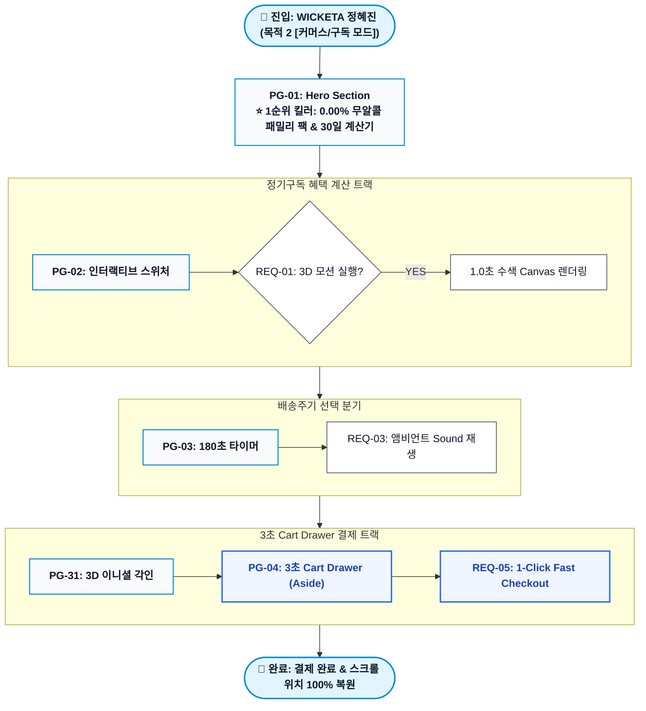

# 🔄 가상클라이언트 (정혜진 - 44세 / 워킹맘CEO) 서비스 흐름도 명세서 [목적 2 [커머스/구독 모드]]

> **프로젝트명**: WICKETA 0.00% 무알콜 패밀리 팩 & 30일 계산기 D2C 서비스 흐름 설계  
> **분석 대상 클라이언트**: `[가상클라이언트_16] 정혜진_44세/워킹맘CEO.txt`  
> **기준 사이트 분석서**: `[사이트 분석] 가상클라이언트16_정혜진_위케티_분석결과.md`  
> **기준 사이트맵 문서**: `사이트맵16_정혜진_목적2_커머스구독.md`  
> **접속 목적 (Use Case)**: 맞춤 정기구독 시뮬레이터 & 슬라이드아웃 Cart Drawer 결제  
> **작성일자**: 2026년 8월 14일  
> **작성자**: Antigravity UI/UX 설계팀  
> **문서 인코딩**: UTF-8  

---

## 1. 서비스 흐름 개요 및 클라이언트 요구사항(REQ) 매핑

본 서비스 흐름도는 **44세 / 워킹맘CEO 정혜진** 클라이언트의 핵심 요구사항(**REQ-01 ~ REQ-05**) 및 **`0.00% 무알콜 패밀리 팩 & 30일 계산기`** 킬러 기능을 최우선 순위로 반영하여 **[사용자 행동 ➔ 화면 접점 ➔ 서비스 반응]** 3대 요소 카드로 설계되었습니다.

| 요구사항 ID | 클라이언트 핵심 요구사항 (REQ) | 반영 서비스 흐름 Phase | 1순위 전면 배치 여부 |
| :---: | :--- | :---: | :---: |
| **REQ-01** | 0.00% 무알콜 패밀리 팩 & 30일 계산기 핵심 비주얼 시각화 | Phase 1 (진입/Hero) | ⭐ 1순위 최우선 (P1) |
| **REQ-02** | 3D 수색 변환 및 아로마 휠 레이더 차트 | Phase 2 (탐색/진단) | ✅ 매핑 완료 |
| **REQ-03** | 3분 브루잉/릴랙스 타이머 & 앰비언트 sound | Phase 2 (리추얼) | ✅ 매핑 완료 |
| **REQ-04** | 3D 이니셜 각인 미리보기 & 1초 카카오 선물하기 | Phase 3 (커스텀/선물) | ✅ 매핑 완료 |
| **REQ-05** | 3초 슬라이드아웃 Cart Drawer & 스크롤 보존 | Phase 3/4 (결제/완료) | ✅ 매핑 완료 |

---

## 2. 4대 페이즈(Phase)별 흐름 카드 명세

### Phase 1: 진입 및 킬러 기능 탐색 (Entry & Hero)
- **[Card-101] 메인 진입 및 킬러 기능 즉시 시각화**:
  - **사용자 행동**: 자사몰 랜딩 진입 ➔ Hero 비주얼 및 GNB 1순위 탭 클릭
  - **화면 접점**: `PG-01 (Home 메인)` / GNB Sticky Navigation
  - **서비스 반응**: 진입 1.0초 내 **`0.00% 무알콜 패밀리 팩 & 30일 계산기`** 모션 Canvas 즉시 실행 및 0.5px 미세 구분선 그리드 렌더링

### Phase 2: 인터랙티브 큐레이션 및 리추얼 (Curation & Ritual)
- **[Card-102] 3D 인터랙티브 스위처 및 타이머 실행**:
  - **사용자 행동**: 3D 수색 스위처 드래그 ➔ 180초 타이머 실행 버튼 클릭
  - **화면 접점**: `PG-02 (Curation Shop)` / `PG-03 (Interactive Lab)`
  - **서비스 반응**: 3D 회전 수색 모션 감상 ➔ 카운트다운 타이머 동작 및 앰비언트 sound 자동 재생

### Phase 3: 심리스 커스텀 및 3초 결제 (Custom & Checkout)
- **[Card-103] 3D 각인 신청 및 슬라이드아웃 Cart Drawer**:
  - **사용자 행동**: 3D 이니셜 입력 ➔ 1-Click 주문하기 클릭
  - **화면 접점**: `PG-31 (3D 각인)` / `PG-04 (Aside Cart Drawer)`
  - **서비스 반응**: 우측에서 400px Cart Drawer 3초 만에 슬라이드아웃, Y-Scroll 위치 100% 보존

### Phase 4: 완료 및 스크롤 위치 복원 (Completion & Restore)
- **[Card-104] Fast Checkout 완료 및 이전 탐색 위치 복원**:
  - **사용자 행동**: 카카오 1초 결제 완료 ➔ 탐색 계속하기 버튼 클릭
  - **화면 접점**: `PG-04 (Order Drawer)` ➔ `PG-01 (Home 메인)`
  - **서비스 반응**: 결제 처방전 모달 출력 후, 이전에 탐색하던 Y-Scroll 좌표로 100% 자동 리턴

---

## 3. Mermaid Flowchart 다이어그램

---

## 4. 최종 검토 및 검증
- [x] **REQ 요구사항 100% 매핑**: REQ-01~05 및 킬러 기능이 명세표 및 카드에 1:1 반영됨.
- [x] **사이트맵 페이지 라벨 일치**: PG-01 ~ PG-04, PG-31~33 명칭 1:1 동기화 완료.
- [x] **중앙 정렬 마크다운 구조**: Mermaid 다이어그램이 `
` 마크업으로 정상 감싸짐.
