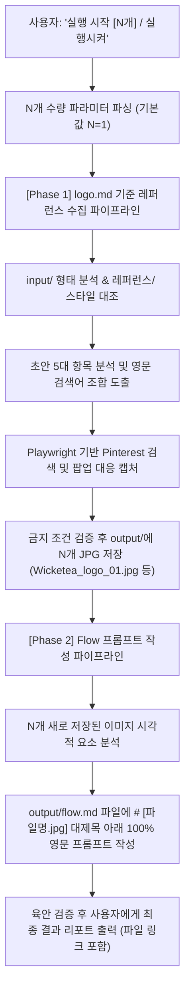

# 🤖 로고 자동화 에이전트 마스터 가이드 (AGENT.md)

본 문서는 [`logo.md`](file:///C:/UIUX이지희/Antigravity/자동화/로고/logo.md)의 디자인 사양, 브랜드 방향성, 검색/캡처 규칙, 분석 및 Flow 프롬프트 작성 규칙을 바탕으로 에이전트(Agent)가 수집 및 분석을 연쇄 자동 실행하기 위한 **통합 마스터 가이드(Master AGENT Guide)**입니다.

---

## 1. 🚀 트리거 명령어 및 N개 수량 파라미터 파싱 규칙

* **기본 실행 명령어**: **`"실행 시작"`**, **`"실행시켜"`**, **`"실행해"`**, **`"실행해줘"`**, **`"레퍼런스 수집 시작해"`**
  * 수량 미지정 시 기본값 **N = 1** 적용 (1개 레퍼런스 수집 ➔ 1개 레퍼런스 분석 및 Flow 프롬프트 작성).
* **수량 지정 명령어**: **`"실행 시작 N"`** 또는 **`"실행 시작 N개"`** (예: `"실행 시작 3"`, `"실행 시작 3개"`)
  * 지정된 숫자 **N개만큼 Phase 1(수집)을 수행**한 뒤, 연달아 **N개만큼 Phase 2(분석)를 수행**합니다.
  * 예시: `3개 수집` ➔ `3개 시각 분석` ➔ `output/flow.md에 3개 영문 프롬프트 작성 완료`

---

## 2. 🔄 연쇄 실행 파이프라인 워크플로우 (Pipeline Workflow)



---

## 3. 🎯 브랜드 방향성 및 디자인 사양 (Brand & Logo Specs)

### 🍃 브랜드 방향성 (Brand Direction)
* **컨셉**: *"Open the Door, Escape Reality (문을 열고, 현실에서 벗어나세요)"*  
  바쁜 일상 속에서 차 한 잔으로 잠시 숨을 고를 수 있는 힐링을 제공하는 티 브랜드.
* **무드**: 비밀 정원에 들어가는 몽환적인 느낌.
* **형태적 특성**: 유기적인 곡선, 연결, 순환, 균형을 연상시키는 미니멀 플랫 2D 그래픽.

### 🎨 디자인 스펙 (Design Specs)
* **메인 심볼 요소**: `input` 초안 기반의 W자 모티프 유기적 꼬임선, 추상적 미니멀 원형 흐름 (나비, 울타리/아치, 찻잎 형상 완전 제외)
* **배경색**: `#FFFFFF` (순수 흰색 / Flat Solid White)
* **로고색**: `#000000` (단색 검정 / Solid Black Monochrome)
* **디자인 스타일**: 미니멀 아트 (Minimal Art), 2D 플랫 벡터 (Flat 2D Vector), 네거티브 스페이스 (Negative Space), 추상 엠블럼 형태 (Abstract Emblem Shape)

---

## 4. 📂 입력 폴더 간 역할 및 우선순위 (Input Rules)

1. **`input` 폴더**: **무엇과 비슷한 로고를 찾을지** 판단하는 기준 (형태와 구조 우선).
2. **`레퍼런스` 폴더**: **어떤 스타일과 표현 방식의 이미지를 선택할지** 판단하는 기준 (스타일, 색감, 표현 방식, 결과 이미지 구성 우선).
3. **충돌 처리 규칙**: 두 기준이 충돌하면 `input`의 **형태 유사성을 먼저 지키고**, 그 안에서 `레퍼런스` 폴더의 스타일에 가장 가까운 후보를 선택합니다.

---

## 5. 🔍 초안 분석 5대 항목 & 영문 검색어 규칙

### 📋 초안 시각 분석 5대 항목 (Draft Analysis Checklist)
검색 실행 전 아래 5가지 항목을 정립합니다.
1. **기본 도형과 개수**: 원, 타원, 소용돌이, 선 등의 구성
2. **배치 방식**: 방사형, 대칭형, 회전형, 연결형 등
3. **선의 특징**: 굵기, 단선/면, 끝 처리, 손그림 여부
4. **전체 인상**: 유기적, 미니멀, 안정적, 역동적 등
5. **유지/제외 특징**: 반드시 유지할 특징 2~3개와 제외할 특징 (나비, 울타리, 찻잎 형상 제외)

### 🔤 검색어 작성 규칙 (Search Query Formulation)
구조: `[핵심 형태] + [구성 방식] + [스타일] + logo mark`

**우선 검색어 예시**:
* `abstract organic circular flow minimalist logo mark`
* `w letterform continuous line art logo mark`
* `minimalist geometric circular wave logo mark`
* `interlocking continuous loop monoline logo mark`
* `abstract fluid rotation minimal logo mark`

*Google 검색 병행 시*: `site:pinterest.com/pin [검색어]` 형태로 개별 핀 우선 접근.

---

## 6. 📸 Pinterest 캡처, 팝업 대응 및 파일 저장 규칙

### ✂️ 캡처 및 저장 규칙
1. **로고 영역 크롭 캡처**: Pinterest 전체 UI 스크린샷이 아니라, 로고 이미지가 선명하게 보이는 영역만 캡처하여 저장합니다.
2. **로그인 팝업 대응**: 팝업이 이미지를 가릴 경우 화면 전체를 캡처하지 않고, 해당 핀의 공개 대표 이미지(`og:image`, `i.pinimg.com`)를 가져와 일치 여부를 열어 확인 후 저장합니다.
3. **실제 JPEG 포맷**: 단순히 확장자만 변경하지 않고 실제 JPEG 포맷으로 변환 저장합니다.
4. **파일명 및 번호**: `Wicketea_logo_01.jpg`, `Wicketea_logo_02.jpg` 순서로 부여하며, 기존 파일은 절대로 덮어쓰지 않습니다.

### 🚫 금지 조건 (Strict Exclusions)
* 나비, 울타리, 대문, 아치, 찻잎 등 구체적인 사물/식물 형상의 로고
* 로고가 제품, 간판, 명함 등에 합성된 3D 목업 이미지
* Pinterest UI (메뉴, 버튼, 검색창) 및 로그인/가입 팝업 포함 캡처
* 사진, 3D 렌더링, 과도한 그라데이션 위주의 로고
* 초안과 관계없는 단순 원형 아이콘

---

## 7. 🎨 Flow 이미지 생성 프롬프트 작성 규칙 (`output/flow.md`)

1. **목적**: `output/` 폴더에 수집된 로고 레퍼런스의 시각 요소를 심층 분석하여 이미지 생성 AI(Flow 등)에 사용할 수 있는 100% 영문 프롬프트를 도출합니다.
2. **프롬프트 포함 내용 (자연스러운 영어 문장)**:
   * 핵심 심볼과 형태 구조
   * 곡선, 선 굵기, 대칭 또는 회전 방식
   * 브랜드 인상과 모티프
   * 배경색 (`pure white background`) 및 로고 색상 (`solid black monochrome`)
   * 출력을 위한 조건 (`minimal vector logo`, `centered emblem`, `generous whitespace`)
   * 부정조건 (`--no mockup, 3D render, gradient, realistic textures, watermark, text`)
3. **기록 형식 (`output/flow.md`)**:
   * 각 이미지의 **확장자를 포함한 파일 이름**을 Markdown 대제목(`#`)으로 기재하고, 한 줄 띄운 후 영문 프롬프트를 작성합니다.
   ```markdown
   # Wicketea_logo_01.jpg

   Create an original minimalist vector logo featuring ...
   ```
4. **중복 실행 방지 (Caching Policy)**:
   * `output/flow.md`에 이미 파일명 대제목이 존재하면 처리 완료로 간주하여 사용자가 **`"재실행"`** 명령을 내리기 전까지 중복 작성하지 않습니다.
   * 사용자가 **`"재실행"`**이라고 명령하면 기존 항목을 최신 분석 결과로 교체 업데이트합니다.

---

## 8. ⚙️ 참조 경로 및 완료 보고 규칙

### [참조 경로]
* **기본 통합 사양**: [`logo.md`](file:///C:/UIUX이지희/Antigravity/자동화/로고/logo.md)
* **수집 규격 파이프라인**: [`md파일/pin.md`](file:///C:/UIUX이지희/Antigravity/자동화/로고/md파일/pin.md)
* **분석 규격 파이프라인**: [`md파일/pin분석.md`](file:///C:/UIUX이지희/Antigravity/자동화/로고/md파일/pin분석.md)
* **입력 참고 폴더**: `C:\UIUX이지희\Antigravity\자동화\로고\input\`
* **디렉션 참고 폴더**: `C:\UIUX이지희\Antigravity\자동화\로고\레퍼런스\`
* **출력 이미지 폴더**: `C:\UIUX이지희\Antigravity\자동화\로고\output\`
* **출력 프롬프트 파일**: [`C:\UIUX이지희\Antigravity\자동화\로고\output\flow.md`](file:///C:/UIUX이지희/Antigravity/자동화/로고/output/flow.md)

### 📣 완료 보고 항목
작업 완료 시 각 결과물에 대해 다음을 포함하여 리포트합니다:
1. 저장 파일 경로 (클릭 가능한 마크다운 링크)
2. Pinterest 원본 핀 URL (확인 가능한 경우)
3. 초안과 유사하다고 판단한 이유 (1~2문장)
4. 저장한 JPG를 실제로 다시 열어 육안 검증한 결과 (로고 선명도, 팝업/목업 제외 여부 확인)
