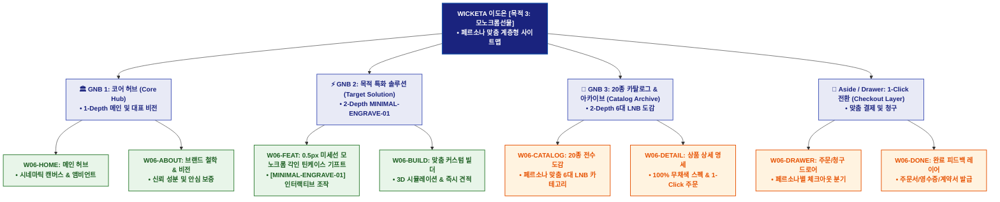

# 🗺️ WICKETA 이도은 사이트맵 [목적 3: 0.5px 미세선 모노크롬 각인 틴케이스 기프트]

> **프로젝트명**: WICKETA 미니멀 테크 & 디자이너 안식 콘솔 (모노크롬선물 특화 사이트맵)  
> **클라이언트 정보**: [가상클라이언트_06] 이도은  
> **적용 레이아웃 아키타입**: `A-1/C-2 미니멀 테크 & 디자이너 안식 콘솔 (Linear & Arc)`  
> **연계 서비스 흐름도**: `04_설계_및_스토리보드/02_서비스 흐름도/06_이도은/서비스_흐름도_목적3_모노크롬선물.md`  
> **접속 목적**: 0.5px 미세선 모노크롬 각인 틴케이스 기프트  
> **목적별 고유 킬러 기능**: **디자이너 타이포그래피 각인 모듈 (`MINIMAL-ENGRAVE-01`)**  
> **작성일자**: 2026년 8월 21일  
> **작성자**: Antigravity UI/UX 총괄 설계팀  
> **문서 인코딩**: UTF-8 (유니코드)  

---

## 1. 목적별 웹사이트 정보 아키텍처 (Information Architecture) 개요

본 사이트맵은 사용자의 명확한 이용 목적(**0.5px 미세선 모노크롬 각인 틴케이스 기프트**)에 최적화하여, 불필요한 탐색 비용을 최소화하고 `MINIMAL-ENGRAVE-01` 킬러 인터랙션을 거쳐 전환 접점까지 최단 동선으로 도달할 수 있도록 설계된 계층형 정보 구조도입니다.

---

## 2. 목적 특화 계층형 사이트맵 구조도 (Hierarchical Tree)

```text
WICKETA 플랫폼 루트 [목적 3: 모노크롬선물 특화 트리]
│
├── 🏛️ [GNB 1: 브랜드 코어 허브 (Core Hub)]
│   ├── W06-HOME: 메인 허브 캔버스 (시네마틱 캔버스 & 앰비언트 오디오)
│   └── W06-ABOUT: 브랜드 철학 및 신뢰 성분 검증 리포트
│
├── ⚡ [GNB 2: 목적 특화 솔루션 (Target Solution)]
│   ├── W06-FEAT: 0.5px 미세선 모노크롬 각인 틴케이스 기프트 (MINIMAL-ENGRAVE-01)
│   └── W06-BUILD: 맞춤형 커스텀 빌더 & 실시간 견적 산출
│
├── 📖 [GNB 3: 20종 카탈로그 아카이브 (Catalog Archive)]
│   ├── W06-CATALOG: 6대 LNB 카테고리 기반 20종 전수 도감
│   └── W06-DETAIL: 상품별 무채색 상세 정보 & 1초 담기
│
└── ⚙️ [공통 유틸리티 & 체크아웃 레이어 (Utility & Aside)]
    ├── W06-DRAWER: 페르소나 맞춤 주문/청구 드로어
    └── W06-DONE: 최종 완료 피드백 및 주문/계약 확인증 발급
```

---

## 3. 페이지별 상세 계층 명세표 (Screen Hierarchy Specification)

| 계층 분류 | 화면 ID | 화면 명칭 | 주요 콘텐츠 및 인터랙션 기능 | 핵심 UI 컴포넌트 ID | 상태 (Status) |
| :--- | :--- | :--- | :--- | :--- | :---: |
| **1-Depth (메인)** | `W06-HOME` | 메인 허브 캔버스 | 히어로 비주얼, 브랜드 슬로건, 킬러 기능 진입 CTA | `HERO-06`, `AUDIO-PLAYER-01` | `🎯 반영 목표` |
| **2-Depth (GNB 1)** | `W06-ABOUT` | 브랜드 철학 및 신뢰 성분 | KTR 3無(무설탕/무카페인/무색소) 공인 성적서, 안심 보증 | `TRUST-CERT-01` | `📐 설계 기준` |
| **2-Depth (GNB 2)** | `W06-FEAT` | 모노크롬선물 특화 콘솔 | 디자이너 타이포그래피 각인 모듈 인터랙티브 조작 및 시뮬레이션 | `MINIMAL-ENGRAVE-01` | `🎯 반영 목표` |
| **3-Depth (GNB 2)** | `W06-BUILD` | 맞춤 커스텀 빌더 | 3D 패키징 뷰어, 옵션 조합기, 실시간 견적 자동 연산 | `CUSTOM-BUILD-01` | `🔍 확인 필요` |
| **2-Depth (GNB 3)** | `W06-CATALOG`| 20종 전수 상품 도감 | 6대 맞춤 LNB 카테고리 필터, 20종 모노크롬 카드 그리드 | `CATALOG-GRID-01` | `📐 설계 기준` |
| **3-Depth (GNB 3)** | `W06-DETAIL` | 상품 상세 정보 명세 | 성분표, 음용 가이드, 1-Click 장바구니 담기 | `PRODUCT-SPEC-01` | `📐 설계 기준` |
| **Aside Layer** | `W06-DRAWER` | 주문 및 청구 드로어 | 페르소나별 분기 체크아웃 (일반/B2B/시니어/엔지니어) | `CHECKOUT-DRAWER-01` | `🎯 반영 목표` |
| **Modal Layer** | `W06-DONE` | 접수 및 주문 완료 모달 | 주문 번호, 계약서 발송, 카카오 알림톡/영수증 출력 | `COMPLETE-MODAL-01` | `📐 설계 기준` |

---

## 4. 목적별 사이트맵 다이어그램 (Mermaid Branching Tree)

<div align="center">



</div>
