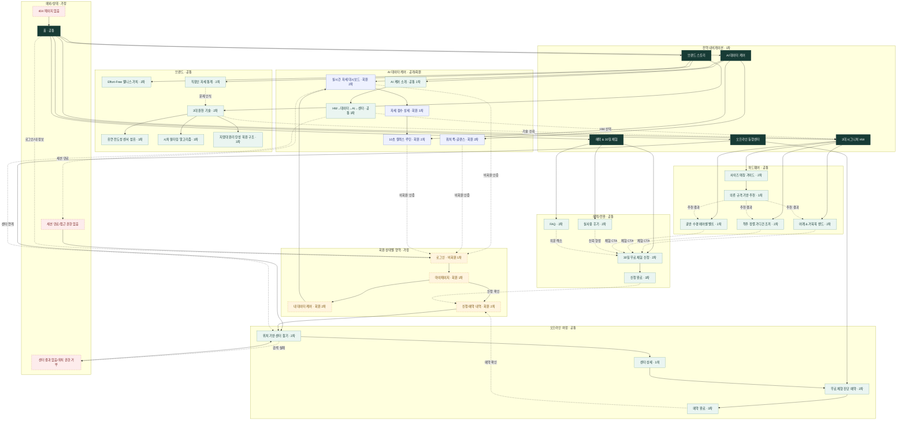

# 스밈(SEUMIM) 통합형 스마트 홈케어 체형 교정 플랫폼 사이트맵

## 1. 프로젝트 개요

- **브랜드/서비스:** 스밈(SEUMIM), 하드웨어(HW)·AI 소프트웨어(SW)·오프라인 동행센터(O2O)를 연결한 통합형 스마트 홈케어 체형 교정 플랫폼
- **핵심 타깃:** 25~39세 사무직 직장인, IT 개발자, 마케터 등 하루 평균 9.4시간 이상 앉아서 근무하는 사용자
- **핵심 메시지:** “일상에 바른 균형이 스며들게, 당신의 일상 균형 스밈(SEUMIM)”
- **서비스 약속:** 몸을 강하게 조이거나 퇴근 후 고강도 운동을 요구하지 않고, 업무 중 자연스럽게 바른 자세를 돕는다.
- **사업 연결 구조:** HW 구매 → 앱 자세 데이터 축적 → AI 미니멀 케어 구독 → 오프라인 동행센터 1:1 진단
- **정보 구조 원칙:** 5개 GNB, 최대 3단계 깊이, 제품·데이터·센터·체험 전환의 상호 연결, 공통 페이지의 단일화

> **가정 표기 원칙:** 입력 문서에 회원 인증, 마이페이지, 결제/주문, 정책 페이지의 상세 요구가 없다. 아래 구조에서는 회원 상태별 정보 접근에 필요한 최소 페이지인 로그인·마이페이지와 예외 처리 페이지만 `가정`으로 표시했다. 결제·주문 페이지는 임의로 추가하지 않았다.

## 2. 설계 근거와 핵심 사용자 목표

### 설계 근거

1. HW·AI·O2O가 분절돼 보이지 않도록 홈과 각 상세 페이지에서 3중 선순환 여정으로 교차 연결한다.
2. 제품 선택 전에는 3대 원천 기술과 일반 의류 규격 기반 사이즈 추천을 노출해 신뢰와 선택 확신을 높인다.
3. 자세 점수, 스마트워치 링, 10초 루틴은 로그인 회원의 데이터 케어 경험으로 묶되, 비회원도 기능 설명은 볼 수 있게 구분한다.
4. 센터 검색에서 예약 완료까지 4단계 이내로 구성하고, 위치 권한 거부·검색 결과 없음도 복구 경로를 제공한다.
5. 후기·FAQ·30일 체험을 하나의 혜택 축으로 구성하고 전역 고정 CTA에서 바로 접근하게 한다.

### 핵심 사용자 목표

| 사용자 유형 | 핵심 목표 | 대표 진입점 | 성공 상태 |
|---|---|---|---|
| 자세 문제를 인지한 직장인 | 문제의 심각성과 스밈의 해결 방식을 빠르게 이해 | 홈, 직장인 자세 통계 | 기술·제품·체험 중 다음 행동 선택 |
| 제품 탐색 사용자 | 신체 고민에 맞는 HW와 정확한 사이즈 확인 | 3대 시그니처 HW, 제품 상세 | 사이즈 추천 확인 후 30일 체험 신청 |
| 앱/워치 사용 관심자 | 데이터 측정 방식과 짧은 케어 경험 이해 | AI 데이터 케어 | 대시보드·워치·10초 루틴 가치 확인 |
| 기존 회원 | 실시간 자세 점수와 케어 현황 확인 | 로그인, 내 데이터 케어 | 대시보드 확인 또는 루틴 실행 |
| 오프라인 체험 희망자 | 가까운 센터를 찾고 무료 진단/시착 예약 | 동행센터 찾기, 고정 CTA | 4단계 예약 완료 및 예약 확인 |
| 구매/구독 검토자 | 실제 후기, FAQ, 30일 체험 조건 확인 | 혜택 & 30일 체험 | 신청 완료 또는 제품/AI 상세로 복귀 |

## 3. 전역 내비게이션 구조

### 고정 헤더

| 구분 | 항목 | 연결 |
|---|---|---|
| 브랜드 | 스밈 로고 | 홈 |
| GNB 1 | 브랜드 스토리 | 웰니스 가치, 직장인 자세 통계, 3대 원천 기술 |
| GNB 2 | 3대 시그니처 HW | 제품 3종 상세, 사이즈 가이드 |
| GNB 3 | AI 데이터 케어 | 서비스 소개, 실시간 대시보드, 워치 퀵-글랜스, 10초 루틴 |
| GNB 4 | 오프라인 동행센터 | 센터 찾기, 센터 상세, 무료 체형 진단 예약 |
| GNB 5 | 혜택 & 30일 체험 | 실사용 후기, FAQ, 30일 체험 신청 |
| 유틸리티 | 로그인 / 마이페이지 | 회원 상태에 따라 조건부 노출 (`가정`) |

### 공통 전환 장치

- **메가 메뉴:** HW 제품 3종의 근접 비주얼과 사이즈 가이드 진입점을 제공한다.
- **Floating Sticky CTA:** `30일 무료 체험 및 사전 신청하기`, `오프라인 센터 1회 무료 시착권 받기`를 주요 콘텐츠 페이지에 지속 노출한다.
- **푸터:** 5개 GNB의 핵심 링크와 홈·FAQ를 반복 제공한다. 정책/회사 정보 링크는 입력에 없으므로 범위에서 제외한다.

### 회원 상태별 노출

| 상태 | 노출/접근 | 제한 또는 전환 |
|---|---|---|
| 비회원 | 브랜드·제품·AI 기능 소개·센터·혜택 전체 열람 | 개인 자세 데이터 접근 시 로그인으로 이동 (`가정`) |
| 로그인 회원 | 내 데이터 케어, 루틴, 체험 신청/센터 예약 내역 | 개인 데이터와 신청 내역 표시 (`가정`) |
| 세션 만료/권한 없음 | 접근 안내 페이지 | 로그인 또는 이전 공개 페이지로 복구 (`가정`) |

## 4. 계층형 사이트맵

`[공통]`, `[비회원]`, `[회원]`, `[예외]`는 접근/역할 구분이며, `가정`은 입력 문서에 직접 명시되지 않은 최소 보완 구조다.

```text
홈 [공통·1차]
├─ 브랜드 스토리 [공통·1차]
│  ├─ Effort-Free 웰니스 가치 [공통·2차]
│  ├─ 직장인 자세 통계 [공통·2차]
│  └─ 3대 원천 기술 [공통·2차]
│     ├─ 유연 전도성 센서 섬유 [공통·3차]
│     ├─ 시차 필터링 알고리즘 [공통·3차]
│     └─ 지렛대 원리 탄성 복원 구조 [공통·3차]
├─ 3대 시그니처 HW [공통·1차]
│  ├─ 어깨 & 거북목 프리미엄 밴드 [공통·2차]
│  ├─ 스마트 척추 정렬 가디건 조끼 [공통·2차]
│  ├─ 골반 수평 유지 에어셀 벨트 [공통·2차]
│  └─ 사이즈 매칭 가이드 [공통·2차]
│     └─ 의류 규격 기반 사이즈 추천 [공통·3차]
├─ AI 데이터 케어 [공통·1차]
│  ├─ AI 케어 소개 [공통·2차]
│  │  └─ HW→데이터→AI→센터 선순환 [공통·3차]
│  ├─ 실시간 자세 대시보드 [회원·2차]
│  │  └─ 자세 점수 상세 [회원·3차]
│  ├─ 스마트워치 퀵-글랜스 [회원·2차]
│  └─ 앉은 자리 10초 릴렉스 루틴 [회원·2차]
├─ 오프라인 동행센터 [공통·1차]
│  ├─ 위치 기반 센터 찾기 [공통·2차]
│  │  └─ 센터 상세 [공통·3차]
│  └─ 1회 무료 체형 진단 예약 [공통·2차]
│     └─ 예약 완료 [공통·3차]
├─ 혜택 & 30일 체험 [공통·1차]
│  ├─ 직장인/테크 유저 실사용 후기 [공통·2차]
│  ├─ FAQ [공통·2차]
│  └─ 30일 무료 체험 및 사전 신청 [공통·2차]
│     └─ 신청 완료 [공통·3차]
├─ 로그인 [비회원·1차, 가정]
├─ 마이페이지 [회원·1차, 가정]
│  ├─ 내 데이터 케어 [회원·2차, 가정]
│  └─ 신청·예약 내역 [회원·2차, 가정]
└─ 예외/상태 페이지 [예외·1차, 가정]
   ├─ 404 페이지 없음 [예외·2차, 가정]
   ├─ 센터 검색 결과 없음/위치 권한 거부 [예외·2차, 가정]
   └─ 세션 만료/접근 권한 없음 [예외·2차, 가정]
```

## 5. 페이지별 정의

| ID | 깊이·영역 | 페이지 | 목적 | 핵심 콘텐츠 | 주요 기능 | 연결 페이지 |
|---|---|---|---|---|---|---|
| H | 1차·공통 | 홈 | 브랜드 가치와 HW·AI·O2O 선순환을 한눈에 전달 | 메인/서브 카피, 3대 제품, 자세 점수 미리보기, 센터/체험 CTA | 고정 헤더, 선순환 인포그래픽, Floating CTA | B, P, A, C, O, L/M |
| B | 1차·공통 | 브랜드 스토리 | 문제 인식과 해결 철학을 연결 | 브랜드 메시지, Effort-Free 가치, 통계, 기술 요약 | 섹션 탐색, 관련 제품/체험 CTA | H, B1, B2, B3, P, O3 |
| B1 | 2차·공통 | Effort-Free 웰니스 가치 | 자연스럽게 스며드는 자세 관리 가치 설명 | 메인/서브 카피, 일상 속 사용 맥락 | 제품·AI 케어 교차 링크 | B, P, A1 |
| B2 | 2차·공통 | 직장인 자세 통계 | 타깃 사용자의 문제와 시급성 전달 | 자세 무너짐 미인지 82.3%, 2030 목디스크 25.8%, 병원 치료 미룸 40.4% | 정량 데이터 시각화 | B, B3, P, O3 |
| B3 | 2차·공통 | 3대 원천 기술 | 제품과 데이터 정확성에 대한 신뢰 형성 | 3대 기술 개요 | 기술별 상세 탐색 | B, B31, B32, B33, P |
| B31 | 3차·공통 | 유연 전도성 센서 섬유 | 세탁 가능한 센서 기술 설명 | 일반 의류처럼 수시 세탁 가능 | 관련 HW 연결 | B3, P1, P2, P3 |
| B32 | 3차·공통 | 시차 필터링 알고리즘 | 오작동 진동 스트레스 감소 근거 설명 | 일상 움직임과 불량 자세 구분 | AI 케어 연결 | B3, A1, A2 |
| B33 | 3차·공통 | 지렛대 원리 탄성 복원 구조 | 강체 압박 없이 자연스러운 펴짐 설명 | 탄성 복원 구조 원리 | 관련 HW 연결 | B3, P1, P2, P3 |
| P | 1차·공통 | 3대 시그니처 HW | 고민별 제품 비교와 선택 지원 | 제품 3종 비교, 기술 요약, 사이즈 안내 | 메가 메뉴, 제품 비교, 체험 CTA | H, P1, P2, P3, P4, B3, O3 |
| P1 | 2차·공통 | 어깨 & 거북목 프리미엄 밴드 | 어깨/거북목 고민용 제품 이해 | 0.1mm 시크릿 핏, 관련 원천 기술 | 사이즈 추천 팝업, 30일 체험 CTA | P, P4, B31, B33, O3 |
| P2 | 2차·공통 | 스마트 척추 정렬 가디건 조끼 | 척추 정렬 제품 이해 | 탄성 프레임, 관련 원천 기술 | 사이즈 추천 팝업, 30일 체험 CTA | P, P4, B31, B33, O3 |
| P3 | 2차·공통 | 골반 수평 유지 에어셀 벨트 | 골반/다리 꼬기 고민용 제품 이해 | 다리 꼬기 물리 넛지, 관련 원천 기술 | 사이즈 추천 팝업, 30일 체험 CTA | P, P4, B31, B33, O3 |
| P4 | 2차·공통 | 사이즈 매칭 가이드 | 모호한 S/M/L 대신 익숙한 규격으로 선택 지원 | 상의 95/100 등 의류 규격 매칭 원칙 | 사이즈 추천 시작 | P, P41, P1, P2, P3 |
| P41 | 3차·공통 | 의류 규격 기반 사이즈 추천 | 사용자 입력을 제품 사이즈에 매칭 | 의류 규격/제품별 추천 결과 | 입력, 추천, 제품 상세 복귀 | P4, P1, P2, P3 |
| A | 1차·공통 | AI 데이터 케어 | 앱·워치·루틴의 통합 가치를 설명 | 데이터 케어 개요, 기능 미리보기 | 공개 소개와 회원 기능 분기 | H, A1, A2, A3, A4, L/M1 |
| A1 | 2차·공통 | AI 케어 소개 | HW 데이터가 케어로 이어지는 방식 설명 | 실시간 점수, AI 미니멀 케어 구독, 3중 선순환 | 기능 데모, 로그인 전환 (`가정`) | A, A11, A2, A3, A4, L |
| A11 | 3차·공통 | HW→데이터→AI→센터 선순환 | 통합 플랫폼 구조를 시각적으로 전달 | HW 구매→데이터 축적→AI 구독→센터 진단 | 단계별 관련 페이지 이동 | A1, P, A2, C1 |
| A2 | 2차·회원 | 실시간 자세 대시보드 | 현재 밸런스 상태를 즉시 확인 | 0~100 자세 점수, 컬러 반응형 원형 게이지 | 실시간 시각화, 점수 상세 | A, A21, A3, M1 |
| A21 | 3차·회원 | 자세 점수 상세 | 점수의 구성과 변화 확인 | 바른 자세 유지 시간과 상태 정보 | 상세 데이터 탐색, 루틴 전환 | A2, A3 |
| A3 | 2차·회원 | 스마트워치 퀵-글랜스 | 손목에서 1초 만에 상태 확인 | 바른 자세 유지 시간, 링 UI | 원형 링 차트 인터랙션 | A, A2, A4 |
| A4 | 2차·회원 | 앉은 자리 10초 릴렉스 루틴 | 업무 흐름을 끊지 않는 짧은 케어 제공 | 10초 AI 미니멀 릴렉스 루틴 | 루틴 실행/완료 | A, A2, A21 |
| C | 1차·공통 | 오프라인 동행센터 | 가까운 진단/시착 접점 제공 | 센터 서비스, 무료 체형 진단 안내 | 위치 기반 검색 및 예약 CTA | H, C1, C3, O3 |
| C1 | 2차·공통 | 위치 기반 센터 찾기 | 가까운 전국 제휴 지점 탐색 | 지도, 지점 목록, 거리/기본 정보 | 위치 권한, 지도 검색, 필터 | C, C11, C3, X2 |
| C11 | 3차·공통 | 센터 상세 | 예약 전 지점 정보 확인 | 지점 기본 정보, 체험 가능 안내 | 예약 시작 | C1, C3 |
| C3 | 2차·공통 | 1회 무료 체형 진단 예약 | 4단계 이내로 체험 접수 | 지점→일정→신청 정보→확인 | 단계형 폼, 유효성 검사 | C, C1/C11, C31 |
| C31 | 3차·공통 | 예약 완료 | 접수 성공과 다음 행동 안내 | 예약 요약, 방문 안내 | 마이페이지/홈 이동 (`마이페이지는 가정`) | C, H, M2 |
| O | 1차·공통 | 혜택 & 30일 체험 | 신뢰 해소와 체험 전환을 한곳에 집약 | 후기, FAQ, 무료 체험 CTA | 후기/FAQ 탐색, Floating CTA | H, O1, O2, O3, P |
| O1 | 2차·공통 | 실사용 후기 | 직장인·테크 유저 경험으로 신뢰 강화 | 실사용 찐후기 | 후기 탐색, 관련 제품 이동 | O, P, O3 |
| O2 | 2차·공통 | FAQ | 제품·AI·센터·체험 관련 의문 해소 | 주제별 질문/답변 | 아코디언, 관련 페이지 링크 | O, P, A1, C, O3 |
| O3 | 2차·공통 | 30일 무료 체험 및 사전 신청 | 핵심 전환 접수 | 체험 안내, 신청 정보 | 신청 폼, 유효성 검사 | O, P1/P2/P3, O31 |
| O31 | 3차·공통 | 신청 완료 | 신청 성공과 다음 행동 안내 | 신청 요약, 후속 안내 | 홈/제품/내역 이동 (`내역은 가정`) | H, P, M2 |
| L | 1차·비회원 | 로그인 (`가정`) | 회원 전용 데이터 접근 인증 | 로그인 안내/입력 | 로그인, 원래 목적지 복귀 | H, A2/A3/A4, M |
| M | 1차·회원 | 마이페이지 (`가정`) | 개인 데이터와 신청 상태의 통합 진입 | 데이터 케어/신청·예약 요약 | 회원 메뉴 이동 | H, M1, M2, A2 |
| M1 | 2차·회원 | 내 데이터 케어 (`가정`) | 개인 자세 데이터 진입 관리 | 현재 점수/최근 루틴 요약 | 대시보드·루틴 이동 | M, A2, A4 |
| M2 | 2차·회원 | 신청·예약 내역 (`가정`) | 체험 신청과 센터 예약 확인 | 신청/예약 요약 | 상세 확인, 센터 찾기 이동 | M, C1, O3 |
| X1 | 2차·예외 | 404 페이지 없음 (`가정`) | 잘못된 URL에서 복구 | 오류 안내, 주요 메뉴 | 홈/GNB 이동 | H, B, P, A, C, O |
| X2 | 2차·예외 | 센터 결과 없음/위치 권한 거부 (`가정`) | 검색 실패에서 복구 | 원인 및 대체 검색 안내 | 지역 직접 검색, 재시도 | C1, C |
| X3 | 2차·예외 | 세션 만료/접근 권한 없음 (`가정`) | 회원 기능 접근 실패에서 복구 | 상태 안내 | 로그인/공개 소개 이동 | L, A1, H |

## 6. 주요 사용자 여정

1. **문제 인식 → 제품 체험:** 홈 → 직장인 자세 통계 → 3대 원천 기술 → 제품 상세 → 사이즈 추천 → 30일 체험 신청 → 신청 완료
2. **데이터 케어 이해 → 회원 사용:** 홈 → AI 케어 소개 → 선순환 구조 → 로그인(`가정`) → 실시간 자세 대시보드 → 10초 루틴
3. **오프라인 체험:** 고정 CTA/홈 → 위치 기반 센터 찾기 → 센터 상세 → 무료 체형 진단 예약(4단계 이내) → 예약 완료
4. **불안 해소 → 전환:** 제품 상세 → 실사용 후기 → FAQ → 30일 체험 신청
5. **예외 복구:** 위치 권한 거부/검색 결과 없음 → 지역 직접 검색 → 센터 상세; 세션 만료 → 로그인 → 원래 회원 페이지

## 7. Mermaid 사이트맵



## 8. 구조 검토 결과

- 모든 2·3차 페이지는 하나의 대표 상위 페이지에 귀속되며, 다른 맥락에서는 교차 링크로만 연결해 중복 페이지를 만들지 않았다.
- 모든 노드는 홈, GNB, 상위 페이지, 사용자 여정 또는 예외 복구 경로 중 하나 이상과 연결되어 고립된 페이지가 없다.
- 완료 페이지는 홈 또는 마이페이지로, 예외 페이지는 홈·로그인·센터 찾기로 복구된다.
- 입력에 없는 인증·마이페이지·예외 처리는 모두 `가정`으로 표시했다.
- HW 판매와 AI 구독은 입력에 언급되지만 주문·결제 정책 및 프로세스가 없으므로 결제 관련 페이지는 확정하지 않았다.
