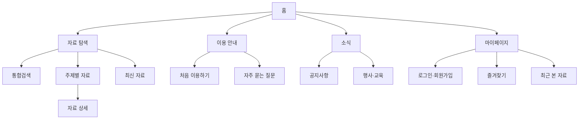

# 사이트 구조맵 조사

> 조사일: 2026-08-07  
> 조사 범위: 현재 폴더의 모든 파일과 외부 참고 자료

## 1. 조사에 참고한 폴더 내부 자료

이 문서는 다음 세 파일을 모두 참고하여 작성했다.

1. `수업 진행 내용.md`
   - 가상 클라이언트의 관점에서 사이트를 분석한다.
   - 분석 결과를 메뉴, 콘텐츠, 기능으로 구분한다.
   - 여러 가상 클라이언트의 분석 결과를 종합한 뒤 사이트 구조맵·사이트맵, 서비스 흐름도, 화면 설계서, 와이어프레임 순서로 발전시킨다.
2. `가상클라이언트 기반 분석 결과 작성 양식.md`
   - 요구사항을 주제 → 부주제 → 메뉴 → 콘텐츠·기능으로 분해한다.
   - 비슷한 항목을 묶고 중복과 누락을 제거한 뒤 계층 구조, 레이블, 내비게이션을 설계한다.
   - 사용자가 목표 정보에 도달할 수 있도록 페이지 간 연결을 점검한다.
3. `디자인 구성요소 설계.pdf`
   - 사이트 구조도와 사이트맵을 단계적으로 작성하여 전체 서비스 흐름과 페이지 구성을 트리 형태로 정리한다고 설명한다(PDF 15쪽, 교재 표시 3쪽).
   - 웹 정보 구조는 콘텐츠를 계층화하고 내비게이션과 정보 체계를 구조화하는 작업이라고 설명한다(PDF 16쪽, 교재 표시 4쪽).
   - 폭이 지나치게 좁고 깊은 구조와 지나치게 넓고 얕은 구조의 문제를 설명하며, 교재 기준으로 한 단계의 메뉴 폭은 5~9개, 깊이는 최대 5단계 이내를 권장한다.
   - 이후 내비게이션, 계층적 페이지 이동, 와이어프레임과 화면 설계로 발전시키는 과정을 제시한다.

## 2. 사이트 구조맵이란?

사이트 구조맵(Site Structure Map)은 **웹사이트나 앱에 어떤 페이지가 존재하고, 각 페이지가 어떤 상하 관계와 연결 관계를 갖는지 한눈에 보여주는 시각적 설계 문서**이다. 실무에서는 사이트 구조도, 사이트 구조 맵, 비주얼 사이트맵(Visual Sitemap), 웹사이트 아키텍처 다이어그램 등으로도 부른다.

보통 홈을 최상위에 두고 주요 메뉴, 하위 메뉴, 상세 페이지를 트리 형태로 연결한다. 각 상자는 하나의 페이지나 페이지 유형을 나타내며, 선은 소속 관계 또는 이동 가능 관계를 나타낸다.

Yale의 정보 구조 가이드는 사이트맵을 “웹사이트 페이지가 어떻게 조직되는지를 나타내는 다이어그램”으로 설명한다. Figma 역시 사이트맵은 페이지가 어떻게 연결되는지 보여주는 지도이며, 더 넓은 개념인 정보 구조(IA)의 일부라고 구분한다.

- [YaleSites — Basic Principles of Information Architecture](https://yalesites.yale.edu/explore-resources/basic-principles-of-information-architecture)
- [Figma — What Is Information Architecture?](https://www.figma.com/resource-library/what-is-information-architecture/)

### 한 문장으로 정리

> 사이트 구조맵은 “사용자가 어떤 메뉴를 거쳐 어느 페이지로 이동할 수 있는가?”와 “각 정보가 사이트 안에서 어디에 속하는가?”를 보여주는 전체 설계도이다.

## 3. 사이트 구조맵을 만드는 목적

### 3.1 전체 범위 확인

사이트에 필요한 페이지와 기능을 한 화면에서 확인할 수 있다. 제작 전 페이지 수와 작업 범위를 예측하고, 누락된 페이지나 불필요하게 중복된 페이지를 찾는 데 도움이 된다.

### 3.2 정보의 계층과 우선순위 결정

가장 중요한 정보를 상위 단계에 두고 세부 정보를 하위 단계에 배치한다. 사용자는 구조를 예측할 수 있어야 하며, 일반적인 정보에서 구체적인 정보로 자연스럽게 내려갈 수 있어야 한다.

### 3.3 메뉴와 내비게이션 설계

구조맵의 1단계와 2단계 항목은 글로벌 내비게이션과 로컬 내비게이션의 기초가 된다. 메뉴명, 브레드크럼, 검색 범위, 푸터 링크도 구조맵을 기준으로 정할 수 있다.

### 3.4 협업 기준 마련

기획자, 디자이너, 개발자, 콘텐츠 작성자와 클라이언트가 같은 페이지 구조를 보면서 논의할 수 있다. 페이지별 담당자, 상태, URL, 콘텐츠 유형을 추가하면 제작 관리 문서로도 사용할 수 있다.

### 3.5 사용자 경험과 접근성 향상

W3C는 사용자에게 제공되는 사이트맵이 사이트 전체의 개요를 제공하고, 콘텐츠의 구성 방식을 이해시키며, 복잡한 내비게이션의 대안이 될 수 있다고 설명한다. 구조가 변경될 때 사이트맵도 함께 갱신해야 한다.

- [W3C WAI — G63: Providing a site map](https://www.w3.org/WAI/WCAG21/Techniques/general/G63.html)

## 4. 서로 비슷해 보이는 문서와의 차이

| 문서 | 핵심 질문 | 표현 대상 | 대표 표현 |
| --- | --- | --- | --- |
| 정보 구조(IA) | 정보를 어떤 원칙으로 조직할 것인가? | 조직, 분류, 레이블, 탐색, 검색 체계 전체 | 분류 체계, 택소노미, 구조맵 |
| 사이트 구조맵 | 어떤 페이지가 어디에 속하고 연결되는가? | 페이지의 계층과 관계 | 상자와 연결선으로 된 트리 |
| 사용자 흐름도(User Flow) | 특정 사용자가 목표를 달성하기 위해 어떤 순서로 행동하는가? | 행동, 선택, 조건, 화면 이동 | 시작·처리·판단·종료 기호와 화살표 |
| 서비스 흐름도 | 사용자와 서비스가 어떤 단계로 상호작용하는가? | 사용자 행동과 시스템·운영 단계 | 단계별 흐름 또는 스윔레인 |
| 와이어프레임 | 한 화면 안에 무엇을 어디에 배치하는가? | 페이지 내부 레이아웃 | 헤더, 버튼, 이미지, 본문 자리 |
| 내비게이션 | 실제 화면에서 어떻게 이동하게 할 것인가? | 메뉴, 링크, 검색, 브레드크럼 | GNB, LNB, 탭, 버튼 |
| XML 사이트맵 | 검색엔진에 어떤 URL을 알려줄 것인가? | 공개 URL과 검색용 메타데이터 | `sitemap.xml` 파일 |
| HTML 사이트맵 | 사용자가 전체 페이지 목록을 어떻게 볼 것인가? | 실제 링크 목록 | 사이트 내 “사이트맵” 페이지 |

Google이 설명하는 사이트맵은 검색엔진 크롤링을 위한 파일이며, 페이지·영상·이미지 등의 관계와 중요 URL을 검색엔진에 전달한다. 수업에서 제작하는 트리형 사이트 구조맵과 목적과 형식이 다르다.

- [Google Search Central — What Is a Sitemap?](https://developers.google.com/search/docs/crawling-indexing/sitemaps/overview)

## 5. 사이트 구조맵에 들어가야 하는 내용

### 필수 항목

- 홈 또는 시작점
- 1차 메뉴(상위 메뉴)
- 2차·3차 메뉴(하위 메뉴)
- 실제 콘텐츠 페이지 또는 대표 페이지 유형
- 페이지 사이의 부모·자식 관계
- 로그인, 회원가입, 검색, 오류, 완료 화면 같은 공통·시스템 페이지

### 프로젝트에 따라 추가할 항목

- 페이지 ID: `P-01`, `P-01-01` 등
- 예상 URL 또는 디렉터리
- 페이지 유형: 목록, 상세, 입력 폼, 검색 결과, 대시보드 등
- 접근 권한: 비회원, 회원, 관리자
- 콘텐츠 상태: 신규, 유지, 수정, 통합, 삭제
- 연결할 외부 사이트 또는 다운로드 파일
- 담당자, 제작 상태, 우선순위
- 연결된 와이어프레임 또는 화면 설계서 링크

### 선과 색을 사용하는 간단한 규칙

- 실선: 기본 부모·자식 관계
- 화살표: 특정 이동 방향을 반드시 표현해야 할 때
- 점선: 관련 페이지, 외부 링크 또는 예외적인 교차 이동
- 색상: 페이지 유형이나 작업 상태를 구분할 때만 제한적으로 사용
- 범례: 선이나 색을 두 종류 이상 사용한다면 반드시 표기

구조맵의 중심은 장식이 아니라 **정보의 소속, 계층, 이름과 연결 관계**이다.

## 6. 폴더의 수업 흐름에 맞춘 제작 방법

### 1단계: 가상 클라이언트 분석 결과 모으기

각 가상 클라이언트가 요구하거나 사이트 이용 중 발견한 메뉴, 콘텐츠, 기능을 모두 모은다. 이 단계에서는 바로 트리를 그리지 말고 원문 요구사항과 출처를 유지한다.

예:

- 초보 사용자: 처음 이용하는 방법, 쉬운 검색, 용어 설명 필요
- 반복 사용자: 최근 본 자료, 즐겨찾기, 빠른 접근 필요
- 관리자: 콘텐츠 등록, 수정, 공개 상태 관리 필요

### 2단계: 페이지 후보 목록 만들기

분석 결과를 실제 페이지나 페이지 유형으로 변환한다.

| 요구사항 | 필요한 콘텐츠·기능 | 페이지 후보 |
| --- | --- | --- |
| 원하는 자료를 찾고 싶다 | 키워드 검색, 필터 | 통합검색, 검색 결과 |
| 자료의 내용을 확인하고 싶다 | 제목, 설명, 첨부파일 | 자료 상세 |
| 관심 자료를 저장하고 싶다 | 즐겨찾기 | 내 즐겨찾기 |
| 처음 이용하는 방법을 알고 싶다 | 단계별 안내, FAQ | 이용 안내, 자주 묻는 질문 |

### 3단계: 중복과 누락 정리

- 목적이 같은 페이지는 통합한다.
- 이름만 다르고 내용이 같은 항목을 찾는다.
- 내용이 거의 없는 페이지는 상위 페이지의 콘텐츠 섹션으로 합칠 수 있는지 검토한다.
- 로그인 실패, 검색 결과 없음, 권한 없음, 제출 완료 같은 예외 화면이 빠지지 않았는지 확인한다.

### 4단계: 사용자 기준으로 그룹화

회사의 내부 부서명보다 사용자가 이해하는 주제나 행동을 기준으로 묶는다. 예를 들어 내부 조직이 “콘텐츠운영팀”이라고 해서 메뉴명을 그대로 “콘텐츠운영팀”으로 만들기보다 사용자가 찾는 “자료 찾기”, “이용 안내”처럼 표현한다.

### 5단계: 계층과 메뉴 깊이 결정

홈에서 큰 범주를 나누고, 각 범주 아래에 세부 페이지를 배치한다. 폴더의 NCS 교재는 폭 5~9개, 최대 깊이 5단계 이내를 권장한다. 다만 이 숫자는 절대 규칙이 아니라 프로젝트 규모와 사용자 테스트 결과에 따라 조정해야 한다. 외부 가이드도 과도한 상위 메뉴와 깊이를 피하고 핵심 콘텐츠가 적은 클릭으로 도달 가능해야 한다고 강조한다.

- [GCIS — Information architecture: structure information logically](https://www.gcis.gov.za/guidelines/website/information-architecture)

### 6단계: 사용자가 이해하는 레이블 작성

- 이름만 보고 내용을 예상할 수 있게 한다.
- 같은 단계의 표현 방식을 통일한다.
- 내부 약어와 전문 용어를 피한다.
- “기타”, “자료실”, “정보”처럼 범위가 불명확한 이름은 구체화한다.
- 행동 중심 메뉴는 동사형, 정보 중심 메뉴는 명사형 등 프로젝트 규칙을 정한다.

### 7단계: 구조맵을 시각화한다

홈을 최상단에 두고 상위 메뉴부터 세부 페이지까지 연결한다. 모든 교차 링크를 표시하면 그림이 복잡해지므로 기본 구조맵에는 주 계층을 우선 표시하고, 중요한 교차 이동만 점선이나 주석으로 추가한다.

### 8단계: 가상 클라이언트의 목표 경로로 검증한다

각 가상 클라이언트가 다음 과업을 수행한다고 가정하고 경로를 따라가 본다.

- 시작 위치가 어디인가?
- 어떤 메뉴명을 선택할 것인가?
- 목표 페이지까지 불필요한 단계가 있는가?
- 같은 정보를 서로 다른 사용자도 찾을 수 있는가?
- 모바일에서도 동일한 정보 구조가 유지되는가?

구조맵에서 특정 과업의 경로를 색으로 표시하면 간단한 사용자 흐름 검토가 가능하다. 판단 조건과 오류·복귀 과정이 많아지면 별도의 사용자 흐름도로 분리한다.

### 9단계: 다음 결과물로 연결한다

1. 사이트 구조맵에서 페이지와 계층을 확정한다.
2. 사이트맵 표에서 페이지 ID, URL, 상태와 담당자를 관리한다.
3. 서비스 흐름도에서 사용자 행동과 시스템 반응을 설계한다.
4. 화면 설계서에서 각 페이지의 콘텐츠와 기능을 상세화한다.
5. 와이어프레임에서 한 화면 안의 배치와 우선순위를 표현한다.

## 7. 간단한 사이트 구조맵 예시

가상의 리서치 자료 사이트를 수업 흐름에 맞춰 표현한 예시이다.

```text
홈
├─ 자료 탐색
│  ├─ 통합검색
│  ├─ 주제별 자료
│  │  └─ 자료 상세
│  └─ 최신 자료
├─ 이용 안내
│  ├─ 처음 이용하기
│  └─ 자주 묻는 질문
├─ 소식
│  ├─ 공지사항
│  └─ 행사·교육
└─ 마이페이지
   ├─ 로그인·회원가입
   ├─ 즐겨찾기
   └─ 최근 본 자료
```

같은 내용을 Mermaid를 지원하는 Markdown 환경에서는 다음처럼 시각화할 수 있다.



이 구조맵은 페이지의 소속 관계를 보여준다. “사용자가 검색어를 입력하고 결과가 없을 때 무엇을 하는가?” 같은 순서와 조건은 구조맵이 아니라 별도의 사용자 흐름도에서 표현하는 것이 적절하다.

## 8. 외부 예시 이미지와 템플릿 링크

아래 자료는 구조맵의 표현 방식을 보기 위한 외부 예시이다. 저작권은 각 제공처에 있으므로 학습·참고용으로 확인하고, 과제나 결과물에 그대로 복제할 때는 각 사이트의 이용 조건을 확인한다.

### 예시 1: Figma 정보 구조 설명의 사이트맵 이미지

- [예시 이미지 바로 보기](https://cdn.sanity.io/images/599r6htc/regionalized/dc4e2ab64a0c0a9914d5671e3698314b1f642609-1440x800.jpg?auto=format&fit=max&h=800&q=75&w=1440)
- [이미지가 포함된 원문](https://www.figma.com/resource-library/what-is-information-architecture/)
- 확인할 점: 상위 페이지와 하위 페이지를 카드와 연결선으로 구분하는 방법

### 예시 2: Figma Visual Site Map Generator 예시

- [예시 이미지 바로 보기](https://cdn.sanity.io/images/599r6htc/regionalized/40467d2dc98debca35e8d1a119d645ba9dc9b9cb-1108x1108.png?auto=format&fit=max&h=540&q=75&w=540)
- [Figma 사이트맵 템플릿 페이지](https://www.figma.com/templates/sitemap-generator/)
- 확인할 점: 페이지 카드, 화면 썸네일과 연결 관계를 함께 표현하는 방법

### 예시 3: Miro 사이트맵 템플릿

- [예시 이미지 바로 보기](https://images.ctfassets.net/zqoz8juqulxl/6UWPWuEm1QqqpHRaerLicl/dfeb6d12f947f3718276b70d4361bf1b/Sitemap-thumb-web.png?fm=webp&q=75)
- [Miro 사이트맵 예시 모음](https://miro.com/templates/sitemap/)
- 확인할 점: 초기 아이디어용 마인드맵, 발표용 아이콘 구조도, 상세 제작용 카드 구조 등 목적별 표현 차이

### 예시 4: Miro Visual Sitemap Generator

- [예시 이미지 바로 보기](https://images.ctfassets.net/w6r2i5d8q73s/3JfrLYQPxk1QOMXa9klQTx/3dd9a0f2aacb771ef16d1dda2aad741e/diagramming_sitemap_hero_image_EN_standard_4_3.png?fm=webp&q=75)
- [Miro Visual Sitemap Generator 설명](https://miro.com/diagramming/sitemap/)
- 확인할 점: 하나의 캔버스에서 구조맵, 주석과 협업 피드백을 관리하는 방법

## 9. 완성도 검수 체크리스트

### 범위

- [ ] 분석에서 도출한 모든 필수 메뉴, 콘텐츠와 기능이 반영되었는가?
- [ ] 로그인, 검색 결과 없음, 오류, 완료 등 시스템 페이지가 포함되었는가?
- [ ] 중복 페이지와 내용이 거의 없는 페이지를 정리했는가?

### 구조

- [ ] 홈에서 모든 주요 영역으로 연결되는가?
- [ ] 상위·하위 페이지의 소속 관계가 논리적인가?
- [ ] 구조가 지나치게 넓거나 깊지 않은가?
- [ ] 중요한 페이지가 불필요하게 깊은 곳에 있지 않은가?
- [ ] 어디에도 연결되지 않은 고립 페이지가 없는가?

### 이름

- [ ] 사용자가 메뉴명만 보고 내용을 예상할 수 있는가?
- [ ] 같은 단계의 이름이 일관된 기준으로 작성되었는가?
- [ ] 내부 조직명, 약어와 모호한 표현을 피했는가?

### 사용자 관점

- [ ] 각 가상 클라이언트가 목표 페이지까지 도달할 수 있는가?
- [ ] 초보 사용자도 첫 선택지를 이해할 수 있는가?
- [ ] 웹과 모바일에서 정보의 의미와 소속이 일관되는가?
- [ ] 검색, 메뉴, 관련 링크처럼 두 가지 이상의 탐색 방법이 필요한지 검토했는가?

### 문서 관리

- [ ] 페이지 ID와 버전 또는 수정일을 표시했는가?
- [ ] 색상과 선의 의미를 범례로 설명했는가?
- [ ] 실제 사이트가 변경될 때 구조맵도 갱신할 담당자와 기준이 있는가?

## 10. 자주 발생하는 실수

1. **조직도를 그대로 메뉴로 만드는 것**  
   사용자는 회사의 부서 구조보다 자신의 목표와 과업을 기준으로 정보를 찾는다.
2. **모든 링크를 구조맵에 표시하는 것**  
   푸터, 본문 링크와 추천 링크까지 모두 선으로 연결하면 핵심 계층을 읽기 어렵다.
3. **페이지와 기능을 구분하지 않는 것**  
   “검색”은 기능이면서 검색 화면을 가질 수 있다. 페이지인지 페이지 안 기능인지 명시해야 한다.
4. **구조맵에서 화면 레이아웃까지 설계하는 것**  
   구조맵은 페이지 관계를, 와이어프레임은 한 페이지 내부 배치를 다룬다.
5. **정상 경로만 작성하는 것**  
   빈 결과, 오류, 권한 제한, 완료와 취소 화면도 실제 페이지 구조에 영향을 준다.
6. **한 번 만들고 갱신하지 않는 것**  
   실제 사이트와 구조맵이 달라지면 협업과 유지보수 기준으로 사용할 수 없다.

## 11. 최종 정리

수업 과제에서 사이트 구조맵은 가상 클라이언트 분석 결과를 실제 웹사이트의 페이지 체계로 변환하는 첫 번째 설계 결과물이다. 분석에서 나온 메뉴·콘텐츠·기능을 그대로 나열하는 데 그치지 않고, 중복과 누락을 정리하고 사용자가 이해할 수 있는 이름과 계층을 부여해야 한다.

완성된 사이트 구조맵은 다음 질문에 즉시 답할 수 있어야 한다.

- 사이트에는 어떤 페이지가 있는가?
- 각 페이지는 어느 상위 메뉴에 속하는가?
- 사용자는 어떤 메뉴를 통해 목표 페이지를 찾는가?
- 빠지거나 중복되거나 지나치게 깊은 페이지는 없는가?
- 이후 서비스 흐름도, 화면 설계서와 와이어프레임을 어떤 페이지 단위로 제작해야 하는가?

따라서 사이트 구조맵은 단순한 페이지 목록이 아니라 **사용자 요구사항을 사이트의 정보 구조와 제작 범위로 바꾸는 연결 문서**라고 볼 수 있다.

## 12. 외부 참고 자료

- [YaleSites — Basic Principles of Information Architecture](https://yalesites.yale.edu/explore-resources/basic-principles-of-information-architecture)
- [Figma — What Is Information Architecture?](https://www.figma.com/resource-library/what-is-information-architecture/)
- [Figma — Visual Site Map Generator](https://www.figma.com/templates/sitemap-generator/)
- [Miro — Sitemap Templates & Examples](https://miro.com/templates/sitemap/)
- [Miro — Visual Sitemap Generator](https://miro.com/diagramming/sitemap/)
- [W3C WAI — G63: Providing a Site Map](https://www.w3.org/WAI/WCAG21/Techniques/general/G63.html)
- [Google Search Central — What Is a Sitemap?](https://developers.google.com/search/docs/crawling-indexing/sitemaps/overview)
- [GCIS — Information Architecture: Structure Information Logically](https://www.gcis.gov.za/guidelines/website/information-architecture)

