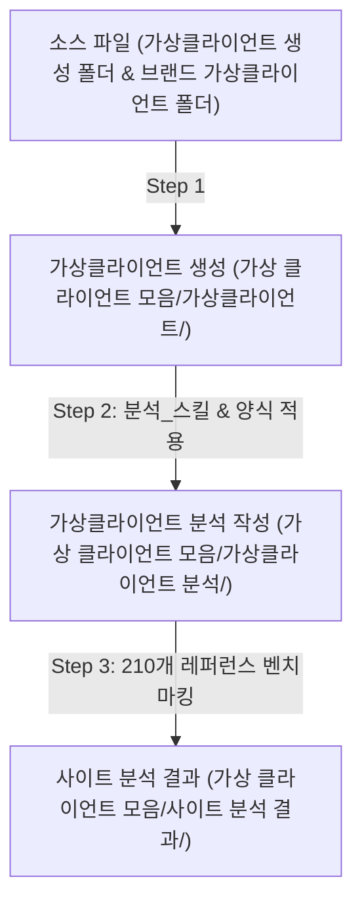

# 가상클라이언트 생성 & 레퍼런스 분석 자동화 스킬 (Virtual Client Automation Skill)

이 Skill은 가상클라이언트 생성부터 분석 스킬 발동(양식 변환), 210개 레퍼런스 사이트 심층 분석(메뉴, 콘텐츠, 기능)까지의 3단계 프로세스를 정밀하게 자동화하고 보관한다.

---

## 1. 전제 조건 및 폴더 구조 검증

작업을 시작하기 전 다음 디렉터리 구조가 존재하는지 확인하고, 없으면 자동으로 생성한다.

- 소스 입력 디렉터리:
  - `C:\yyw\가상클라이언트 생성\` (`브랜드 기획안.txt`, `인터뷰_대화록_및_주제별정리.md`, `페르소나_.txt` 등)
  - `C:\yyw\가상클라이언트 생성\브랜드 가상클라이언트\` (기존 브랜드 가상클라이언트 파일들)
  - `C:\yyw\가상클라이언트 생성\가상 클라이언트 기반 분석 결과 작성 양식.md`
  - `C:\yyw\md_skill\분석_스킬\SKILL.md`
  - `C:\yyw\20개 리서치\`, `C:\yyw\50개 리서치\`, `C:\yyw\140개 리서치\` (총 210개 레퍼런스)
- 결과 저장 디렉터리:
  - `C:\yyw\가상 클라이언트 모음\가상클라이언트\`
  - `C:\yyw\가상 클라이언트 모음\가상클라이언트 분석\`
  - `C:\yyw\가상 클라이언트 모음\사이트 분석 결과\`

---

## 2. 3단계 자동 실행 프로세스 규칙

### 📍 [Step 1] 가상클라이언트 자동 생성
1. `C:\yyw\가상클라이언트 생성\` 폴더 내의 루트 파일들과 `브랜드 가상클라이언트` 폴더 내의 모든 가상클라이언트 파일들을 소스로 읽는다.
2. **중복 방지 게이트**: `C:\yyw\가상 클라이언트 모음\가상클라이언트\` 폴더에 기존에 존재하는 가상클라이언트(1~6번 및 기존 타깃/콘셉트)와 겹치는 타깃, 라이프스타일, 페르소나 설정이 발생하지 않도록 중복을 엄격히 차단한다.
3. **시작 번호 규칙**: 지금부터 자동 생성되는 가상클라이언트의 번호는 **`가상클라이언트_7` (7번)**부터 순차적으로 부여한다 (`가상클라이언트_7`, `가상클라이언트_8`...).
4. 기획안의 서비스 개요, 타깃 문제, 차별화 기술, 디자인 방향, 페르소나 정보를 통합 분석하여 가상클라이언트 브리프를 생성한다.
5. 생성 결과 저장 경로: `C:\yyw\가상 클라이언트 모음\가상클라이언트\가상클라이언트_{N}_{타깃명}.txt` (N >= 7)

### 📍 [Step 2] 분석 스킬 발동 & 작성 양식 맞춤 변환
1. Step 1에서 생성된 가상클라이언트 파일과 `C:\yyw\md_skill\분석_스킬\SKILL.md`의 5대 핵심 영역(디자인, 레이아웃, 메뉴/Flow, 문구, 주요 기능) 및 `가상 클라이언트 기반 분석 결과 작성 양식.md`을 결합한다.
2. 작성 양식의 6대 규격(1. 가상 클라이언트 ~ 6. 검토 결과)에 따라 수치화된 데이터와 정성 평가를 결합하여 분석 보고서를 작성한다.
3. 생성 결과 저장 경로: `C:\yyw\가상 클라이언트 모음\가상클라이언트 분석\가상클라이언트_{N}_{타깃명}_분석결과.md` (N >= 7)

### 📍 [Step 3] 가상클라이언트 기준 210개 레퍼런스 사이트 분석
1. Step 2의 가상클라이언트 분석 보고서와 `20개 리서치`, `50개 리서치`, `140개 리서치` 폴더 내 총 210개 글로벌 레퍼런스 사이트를 교차 벤치마킹한다.
2. 가상클라이언트별 관점에서 다음 **3대 핵심축**으로 결과를 도출하여 독립 파일로 작성한다:
   - **[메뉴 (Menu & Navigation)]**: GNB 계층 구조, 뎁스(Depth 3이내), 타깃별 이동 동선
   - **[콘텐츠 (Content & Copywriting)]**: 브랜드 메시지, 에디토리얼 룩북/매크로 뷰, 3D/알고리즘 스펙, 찐후기
   - **[기능 (Function & Interaction UI)]**: 바이오피드백 데이터 UI, 타깃 액션(카톡 1-Click 공유, O2O 지점 지도 검색, 네이버페이 1-Click 등), Floating Sticky CTA Bar
3. 생성 결과 저장 경로: `C:\yyw\가상 클라이언트 모음\사이트 분석 결과\사이트분석결과_가상클라이언트_{N}_{타깃명}.md` (N >= 7)

---

## 3. 출력 및 파일 명가(Naming Rule) 규정

- 신규 생성되는 가상클라이언트 번호는 `가상클라이언트_7`부터 시작하여 `가상클라이언트_N`까지 순차 부여한다.
- 기존 가상클라이언트(1~6번) 및 소스 파일과 중복된 타깃/콘셉트 생성을 금지하며, 기존 파일의 훼손 없이 지정된 폴더 경로에 저장한다.
- 최종 출력 시 사용자 터미널에는 작업 완료 현황과 생성된 모든 마크다운/텍스트 파일의 Clickable 경로 링크를 제시한다.
